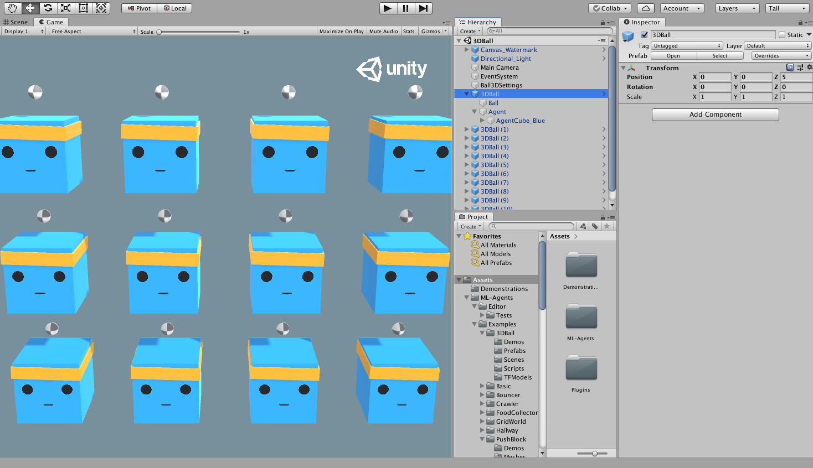
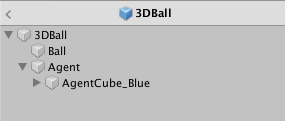
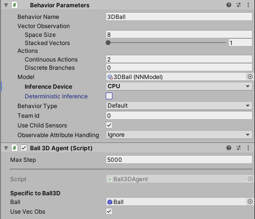
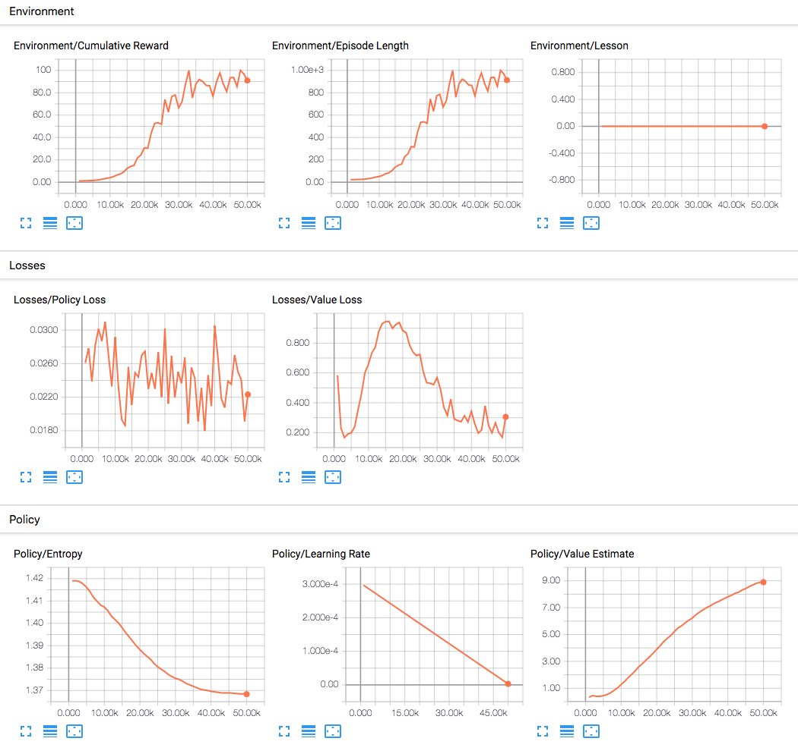

# Getting Started Guide

이 가이드는 Unity에서 제공하는 [예제 환경](Learning-Environment-Examples.md) 중 하나를 열고,
훈련된 모델을 Unity 환경에 통합하는 과정을 처음부터 끝까지 안내합니다.
이 튜토리얼을 읽고 나면, 예제 환경 중 어떤 환경이든 훈련할 수 있게 될 것입니다.
[Unity Engine](https://unity3d.com/unity)에 익숙하지 않다면, 
도움이 되는 팁을 제공하는 [Background: Unity](Background-Unity.md) 페이지를 확인해 보세요.
또한, 머신러닝에 익숙하지 않다면, 간략한 개요와 유용한 팁이 포함된 [Background: Machine Learning](Background-Machine-Learning.md) 페이지를 참조해 보세요.


이 가이드에서는 여러 개의 에이전트 큐브와 공(서로의 복사본들로 구성(프리팹))으로 이루어진 **3D Balance Ball** 환경을 사용합니다.
각 에이전트 큐브는 수평 또는 수직으로 회전하여 공이 떨어지지 않도록 유지하려고 합니다.
이 환경에서 에이전트 큐브는 공을 균형 있게 유지할 때마다 보상을 받는 **에이전트(Agent)** 역할을 합니다.
반면, 공을 떨어뜨리면 페널티로서 부정적인 보상을 받습니다. 
훈련 과정의 목표는 에이전트들이 공을 머리 위에 균형 있게 유지하는 방법을 학습하도록 하는 것 입니다.

시작해봅시다!

## Installation(설치)

아직 설치하지 않았다면, [설치 지침](Installation.md)을 따라주세요.
그 후, 모든 예제 환경이 포함된 Unity 프로젝트를 엽니다 :

1. 메뉴에서 `Window -> Package Manager`로 이동하여 패키지 관리자 창을 엽니다.
1. ML-Agents 패키지로 이동하여 클릭합니다.
1. `3D Ball` 샘플을 찾아 `Import` 버튼을 클릭합니다.
1. **Project** 창에서 `Assets/ML-Agents/Examples/3DBall/Scenes` 폴더로 이동하여 `3DBall` 씬 파일을 엽니다.


**DK Check Point:** 
1. 위 방식으로 접근 시 `3D Ball`항목이 0 KB 로 오류가 발생될 수 있음.
   git을 통해 내려받은 저장소 파일 내부 `ml-agents/com.unity.ml-agents/3DBall/3DBall.unitypackage` 로 대체가능.
1. 샘플 임포트시 **ModelOverrider.cs** 스크립트 파일로 인하여 에러가 발생될 수 있음.
   `Assets/ML-Agents/Examples/SharedAssets/Scripts` 폴더로 이동하여 `ModelOverrider.cs` 파일을 엽니다.
1. `using System.Reflection;` 추가 후, 에러가 발생되는 지점 `LoadSentisModel(byte[] rawModel)` 메서드로 이동하여,
   아래 내용으로 교체하세요.
```sh
    ModelAsset LoadSentisModel(byte[] rawModel)
        {
            
            var asset = ScriptableObject.CreateInstance<ModelAsset>();
           
            var modelAssetDataType = typeof(ModelAsset).Assembly.GetType("NamespaceOfModelAssetData.ModelAssetData"); 
            var modelAssetDataInstance = ScriptableObject.CreateInstance(modelAssetDataType);
     
            FieldInfo modelAssetDataField = typeof(ModelAsset).GetField("modelAssetData", BindingFlags.NonPublic | BindingFlags.Instance);

            if (modelAssetDataField != null)
            {
                modelAssetDataField.SetValue(asset, modelAssetDataInstance);

                FieldInfo valueField = modelAssetDataType.GetField("value", BindingFlags.Public | BindingFlags.NonPublic | BindingFlags.Instance);
                if (valueField != null)
                {
                    valueField.SetValue(modelAssetDataInstance, rawModel);
                }
                else
                {
                    Debug.LogError("Failed to retrieve the value field from ModelAssetData.");
                }
            }
            else
            {
                Debug.LogError("Failed to retrieve modelAssetData field from ModelAsset using reflection.");
            }

            return asset;
        }
```

## Understanding a Unity Environment(Unity 환경 이해하기)

에이전트(_agent_)는 환경(_environment_)을 관찰(_observes_)하고 상호작용하는 자율적인 행위자(_actor_)입니다.
Unity의 맥락에서 환경은 하나 이상의 에이전트 객체와 에이전트가 상호작용하는 다른 엔티티(_entities_)들이 포함된 씬을 의미합니다.

**DK Check Point:** 엔티티(_entities_)란, Unity에서 에이전트와 상호작용할 수 있는 모든 객체나 요소를 의미합니다.
이는 에이전트의 행동이나 학습에 영향을 미칠 수 있는 물리적 오브젝트, 환경의 특성, 또는 다른 NPC 등을 포함합니다.
즉, 에이전트가 목표를 달성하기 위해 고려해야 하거나 피드백을 받을 수 있는 환경 내 모든 요소를 포괄하는 개념입니다.



**Note:** Unity에서 씬(Scene) 내 모든 것의 기본 객체는 GameObject 입니다.
GameObject는 행동(behaviors), 그래픽(graphics), 물리(physics) 등을 포함한 다른 모든 요소를 담는 일종의 컨테이너 역할을 합니다.
GameObject를 구성하는 컴포넌트를 확인하려면, 씬 창(Scene window)에서 해당 GameObject를 선택하고 인스펙터 창(Inspector Window)을 열면 됩니다. 인스펙터에서는 해당 GameObject에 추가된 모든 컴포넌트를 확인할 수 있습니다.

3D Balance Ball 씬을 열면, 단 하나가 아닌 여러 개의 에이전트 큐브(agent cubes)가 포함되어 있다는 것을 처음으로 확인할 수 있습니다.
이 씬에 있는 각 에이전트 큐브는 독립적인 에이전트이지만, 모두 동일한 행동(Behavior)를 공유합니다.
3D Balance Ball에서는 12개의 에이전트가 동시에 학습에 기여하여 학습 속도를 높이기 위해 이와 같이 설계되었습니다.

### Agent(에이전트)

에이전트(Agent)는 환경에서 관찰하고 행동을 수행하는 주체입니다.
3D Balance Ball 환경에서는 에이전트 컴포넌트가 열두 개의 "에이전트(Agent)" GameObject에 배치되어 있습니다.
기본 에이전트(Agent) 객체는 행동에 영향을 미치는 몇가지 속성을 가지고 있습니다 :

- **Behavior Parameters(행동 매개변수)** — 모든 Agent는 반드시 행동을 가져야 합니다. 행동은 에이전트가 어떻게 결정을 내리는지 결정합니다.
- **Max Step(최대 단계)** — 에이전트의 에피소드가 끝나기 전에 진행될 수 있는 시뮬레이션 단계의 수를 정의합니다. 3D Balance Ball에서는
  에이전트가 5000 단계 후에 에피소드를 다시 시작합니다.

**DK Check Point:** 에피소드란, Agent가 환경에서 특정 목표를 이루거나 실패할 때까지의 한 단위 과정입니다. 
즉, 에피소드는 Agent의 학습이나 평가를 위해 환경 내에서 한 번의 시도를 의미하며, 에이전트가 환경과 상호작용하면서 얻은 보상과 결과를 바탕으로 다음 에피소드에서 더 나은 행동을 학습하는 과정을 반복합니다.

#### Behavior Parameters : Vector Observation Space(행동 매개변수 : 벡터 관측 공간)

Agent는 결정을 내리기 전에 세계 속에서 자신의 상태에 대한 관측(Observation)을 수집합니다.
벡터 관측(Vector Observation)은 에이전트가 결정을 내리기 위해 필요한 정보를 담고 있는 실수(floating point) 숫자들의 벡터 입니다.

3D Balance Ball 예제의 행동 매개변수(Behavior Parameters)에서 `관측 공간 크기(Space Size)`는 8로 설정되어 있습니다.
이는 Agent의 관측 정보를 담고 있는 특징 벡터가 여덟 개의 요소로 이루어져 있음을 의미합니다.
이 요소들은 Agent 큐브의 `x` 및 `z` 축 회전 값, 공의 상대적인 위치와 속도의 `x`, `y`, `z` 성분으로 구성되어있습니다.

#### Behavior Parameters : Actions(행동 매개변수 : 행동)

에이전트는 행동이라는 형태로 명령을 받습니다. ML-Agents 툴킷은 행동을 두 가지 유형으로 분류하는데,
`연속형(continuous)`과 `이산형(discrete)`이 있습니다.
3D Balance Ball 예제는 연속형 행동을 사용하도록 프로그래밍되어 있으며, 이는 연속적으로 변할 수 있는 실수(float) 벡터 입니다.
구체적으로 `Space Size`가 2인 연속형 행동 벡터를 사용하여 `x`와 `z` 회전 값을 조절하고, 이를 통해 공이 머리 위에 균형을 유지하도록 합니다.

## Running a pre-trained model(사전 훈련된 모델 실행)

우리는 에이전트의 사전 훈련된 모델(`.onnx` 파일)을 포함하고 있으며, 
Unity 내에서 이러한 모델을 실행하기 위해 [Sentis](Sentis.md)를 사용합니다.
이 섹션에서는 3D Ball 예제를 위한 사전 훈련된 모델을 사용할 것입니다.

1. **프로젝트** 창에서 `Assets/ML-Agents/Examples/3DBall/TFModels` 폴더로 이동하세요.
   `3DBall`을 확장하고 `Agent` 프리팹을 클릭합니다.
   **Inspector**창에서 `Agent` 프리팹을 확인할 수 있습니다.

   **Note**: `3DBall` 씬의 플랫폼들은 `3DBall` 프리팹을 사용하여 생성되었습니다. 
   12개의 플랫폼을 개별적으로 업데이트 하는 대신, `3DBall` 프리팹을 업데이트 하면 됩니다.

   

1. **프로젝트** 창에서 `Assets/ML-Agents/Examples/3DBall/TFModels`에 있는 **3D Ball** 모델을
   Agent 게임 오브젝트 인스펙터 창에서 `Behavior Parameters (Script)` 컴포넌트의 `Model` 속성에 드래그하여 넣으세요.

   

1. 이제 **계층(Hierarchy)** 창의 각 `3DBall` 아래에 있는 각 `Agent`가 `Behavior Parameters`에
   **3DBall** `Model`을 포함하고 있는 것을 확인할 수 있습니다.

   **Note** : 씬 계층에서 검색 창을 사용해 여러 게임 오브젝트를 한 번에 선택하여 수정할 수 있습니다.
1. **Inference Device**를 `CPU`로 설정하세요.

   **Note** : ML-Agents 버전 `2.0` 이상부터는 속성값이 변경됨. `Burst`나 `Default`로 설정하세요.
1. Unity 에디터에서 **Play** 버튼을 클릭하면, `pre-trained(프리트레인된)` 모델을 사용하여 플랫폼들이 공을 균형 잡는 것을 볼 수 있습니다.

   **Note** : `Pre-trained Model(프리트레인된 모델)`이란, 이미 훈련이 완료된 모델을 의미합니다.

## Training a new model with Reinforcement Learning(강화 학습을 사용하여 새로운 모델 훈련하기)

우리는 이 환경에 대한 에이전트의 pre-trained 모델을 제공하지만, 사용자가 직접 만든 환경에서는 
에이전트를 처음부터 훈련시켜야 새로운 모델 파일을 생성할 수 있습니다.
이 섹션에서는 ML-Agents Python 패키지의 강화 학습 알고리즘을 사용하여 이를 수행하는 방법을 보여줍니다.
우리는 훈련과 추론 단계를 구성하는 데 사용되는 인수를 받을 수 있는 편리한 명령어 `mlagents-learn`을 제공했습니다.

### Training the environment

1. Open a command or terminal window.
1. Navigate to the folder where you cloned the `ml-agents` repository. **Note**:
   If you followed the default [installation](Installation.md), then you should
   be able to run `mlagents-learn` from any directory.
1. Run `mlagents-learn config/ppo/3DBall.yaml --run-id=first3DBallRun`.
   - `config/ppo/3DBall.yaml` is the path to a default training
     configuration file that we provide. The `config/ppo` folder includes training configuration
     files for all our example environments, including 3DBall.
   - `run-id` is a unique name for this training session.
1. When the message _"Start training by pressing the Play button in the Unity
   Editor"_ is displayed on the screen, you can press the **Play** button in
   Unity to start training in the Editor.

If `mlagents-learn` runs correctly and starts training, you should see something
like this:

```console
INFO:mlagents_envs:
'Ball3DAcademy' started successfully!
Unity Academy name: Ball3DAcademy

INFO:mlagents_envs:Connected new brain:
Unity brain name: 3DBallLearning
        Number of Visual Observations (per agent): 0
        Vector Observation space size (per agent): 8
        Number of stacked Vector Observation: 1
INFO:mlagents_envs:Hyperparameters for the PPO Trainer of brain 3DBallLearning:
        batch_size:          64
        beta:                0.001
        buffer_size:         12000
        epsilon:             0.2
        gamma:               0.995
        hidden_units:        128
        lambd:               0.99
        learning_rate:       0.0003
        max_steps:           5.0e4
        normalize:           True
        num_epoch:           3
        num_layers:          2
        time_horizon:        1000
        sequence_length:     64
        summary_freq:        1000
        use_recurrent:       False
        memory_size:         256
        use_curiosity:       False
        curiosity_strength:  0.01
        curiosity_enc_size:  128
        output_path: ./results/first3DBallRun/3DBallLearning
INFO:mlagents.trainers: first3DBallRun: 3DBallLearning: Step: 1000. Mean Reward: 1.242. Std of Reward: 0.746. Training.
INFO:mlagents.trainers: first3DBallRun: 3DBallLearning: Step: 2000. Mean Reward: 1.319. Std of Reward: 0.693. Training.
INFO:mlagents.trainers: first3DBallRun: 3DBallLearning: Step: 3000. Mean Reward: 1.804. Std of Reward: 1.056. Training.
INFO:mlagents.trainers: first3DBallRun: 3DBallLearning: Step: 4000. Mean Reward: 2.151. Std of Reward: 1.432. Training.
INFO:mlagents.trainers: first3DBallRun: 3DBallLearning: Step: 5000. Mean Reward: 3.175. Std of Reward: 2.250. Training.
INFO:mlagents.trainers: first3DBallRun: 3DBallLearning: Step: 6000. Mean Reward: 4.898. Std of Reward: 4.019. Training.
INFO:mlagents.trainers: first3DBallRun: 3DBallLearning: Step: 7000. Mean Reward: 6.716. Std of Reward: 5.125. Training.
INFO:mlagents.trainers: first3DBallRun: 3DBallLearning: Step: 8000. Mean Reward: 12.124. Std of Reward: 11.929. Training.
INFO:mlagents.trainers: first3DBallRun: 3DBallLearning: Step: 9000. Mean Reward: 18.151. Std of Reward: 16.871. Training.
INFO:mlagents.trainers: first3DBallRun: 3DBallLearning: Step: 10000. Mean Reward: 27.284. Std of Reward: 28.667. Training.
```

Note how the `Mean Reward` value printed to the screen increases as training
progresses. This is a positive sign that training is succeeding.

**Note**: You can train using an executable rather than the Editor. To do so,
follow the instructions in
[Using an Executable](Learning-Environment-Executable.md).

### Observing Training Progress

Once you start training using `mlagents-learn` in the way described in the
previous section, the `ml-agents` directory will contain a `results`
directory. In order to observe the training process in more detail, you can use
TensorBoard. From the command line run:

```sh
tensorboard --logdir results
```

Then navigate to `localhost:6006` in your browser to view the TensorBoard
summary statistics as shown below. For the purposes of this section, the most
important statistic is `Environment/Cumulative Reward` which should increase
throughout training, eventually converging close to `100` which is the maximum
reward the agent can accumulate.



## Embedding the model into the Unity Environment

Once the training process completes, and the training process saves the model
(denoted by the `Saved Model` message) you can add it to the Unity project and
use it with compatible Agents (the Agents that generated the model). **Note:**
Do not just close the Unity Window once the `Saved Model` message appears.
Either wait for the training process to close the window or press `Ctrl+C` at
the command-line prompt. If you close the window manually, the `.onnx` file
containing the trained model is not exported into the ml-agents folder.

If you've quit the training early using `Ctrl+C` and want to resume training,
run the same command again, appending the `--resume` flag:

```sh
mlagents-learn config/ppo/3DBall.yaml --run-id=first3DBallRun --resume
```

Your trained model will be at `results/<run-identifier>/<behavior_name>.onnx` where
`<behavior_name>` is the name of the `Behavior Name` of the agents corresponding
to the model. This file corresponds to your model's latest checkpoint. You can
now embed this trained model into your Agents by following the steps below,
which is similar to the steps described [above](#running-a-pre-trained-model).

1. Move your model file into
   `Project/Assets/ML-Agents/Examples/3DBall/TFModels/`.
1. Open the Unity Editor, and select the **3DBall** scene as described above.
1. Select the **3DBall** prefab Agent object.
1. Drag the `<behavior_name>.onnx` file from the Project window of the Editor to
   the **Model** placeholder in the **Ball3DAgent** inspector window.
1. Press the **Play** button at the top of the Editor.

## Next Steps

- For more information on the ML-Agents Toolkit, in addition to helpful
  background, check out the [ML-Agents Toolkit Overview](ML-Agents-Overview.md)
  page.
- For a "Hello World" introduction to creating your own Learning Environment,
  check out the
  [Making a New Learning Environment](Learning-Environment-Create-New.md) page.
- For an overview on the more complex example environments that are provided in
  this toolkit, check out the
  [Example Environments](Learning-Environment-Examples.md) page.
- For more information on the various training options available, check out the
  [Training ML-Agents](Training-ML-Agents.md) page.
