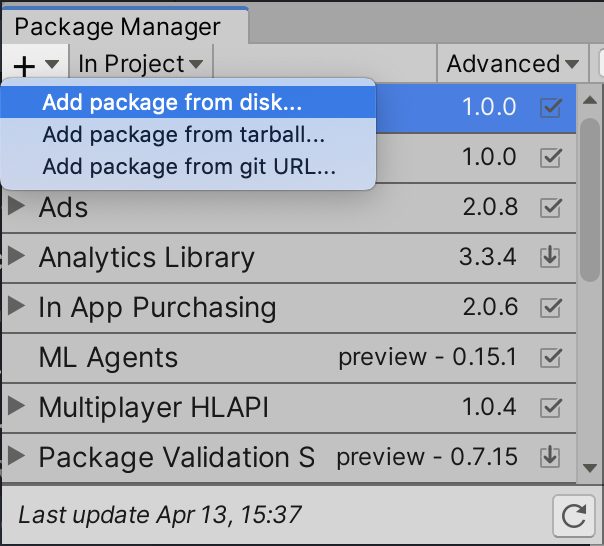
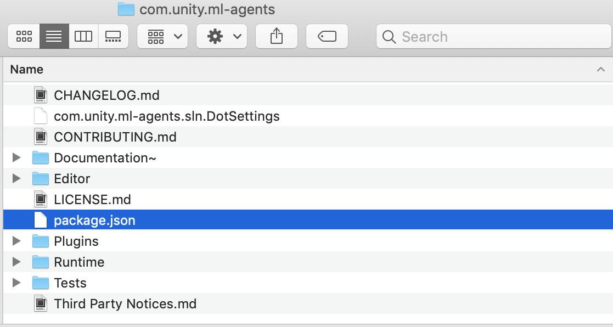

# Installation(설치)

ML-Agents Toolkit은 여러 구성 요소로 이루어져 있습니다.:

- Unity 패키지 ([`com.unity.ml-agents`](../com.unity.ml-agents/))는 Unity 프로젝트에 통합될 Unity C# SDK를 포함하고 있습니다. 이 패키지에는 ML-Agents를 시작하는 데 도움이 되는 샘플이 포함되어 있습니다.
- Unity 패키지
  ([`com.unity.ml-agents.extensions`](../com.unity.ml-agents.extensions/))는 아직 기본 `com.unity.ml-agents`
  패키지의 일부가 되지 않은 실험적인 C#/Unity 구성 요소를 포함하고 있습니다.
  `com.unity.ml-agents.extensions`는 `com.unity.ml-agents`에 직접 의존성을 가집니다.
- 2개의 Python 패키지:
  - [`mlagents`](../ml-agents/)는 Unity 장면에서 행동을 훈련할 수 있게 해주는 머신 러닝 알고리즘을 포함하고 있습니다.
    ML-Agents의 대부분 사용자들은 `mlagents`를 직접 설치하면 충분합니다.
  - [`mlagents_envs`](../ml-agents-envs/)는 Unity 장면과 상호작용할 수 있는 Python API 세트를 포함하고 있습니다.
    이는 Unity 장면과 Python 머신 러닝 알고리즘 간의 데이터 메시징을 용이하게 하는 기본 레이어입니다. 따라서 `mlagents`는
    `mlagents_envs`에 의존합니다.
- Unity [Project](https://github.com/Unity-Technologies/ml-agents/tree/main/Project/)는 툴킷의 다양한 기능을 강조하는
  여러 [example environments(예제 환경)](Learning-Environment-Examples.md)을 포함하고 있어 시작하는 데 도움을 줍니다.

따라서 ML-Agents Toolkit을 설치하고 사용하기 위해서는 다음이 필요합니다:

- Unity 설치 (2023.2 이상)
- Python 설치 (>= 3.10.1, <=3.10.12) 3.10.12 버전을 사용하는 것을 권장합니다.
- Clone this repository (Recommended for the latest version and bug fixes)
  - 참고: 저장소를 클론하지 않으면 예제 환경, 훈련 구성 및 com.unity.ml-agents.extensions 패키지에 접근할 수 없습니다. 또한,
  [Getting Started Guide](Getting-Started.md)는 저장소를 클론한 것으로 가정하고 있습니다.
- `com.unity.ml-agents` Unity 패키지
- `com.unity.ml-agents.extensions` Unity 패키지 (선택 사항).
- `mlagents-envs` 설치
- `mlagents` Python 패키지 설치

### Install **Unity 2023.2** or Later(Unity 2023.2 이상을 설치)

Unity를 [Download(다운로드)](https://unity3d.com/get-unity/download)하고 설치하세요. Unity Hub를 통해 설치하는 것을 강력히 권장합니다. 
이렇게 하면 여러 Unity 버전을 관리할 수 있습니다.

### Install **Python 3.10.12**(Python 3.10.12 설치)

Python 3.10.12를 [installing(설치)](https://www.python.org/downloads/)하는 것을 권장합니다.
Windows를 사용하는 경우 x86이 아닌 x86-64 버전을 설치하세요. Python 환경에 `pip3`가 포함되어 있지 않다면
[instructions(설치 방법)](https://packaging.python.org/guides/installing-using-linux-tools/#installing-pip-setuptools-wheel-with-linux-package-managers)을 참조하세요. 또한, Python 가상 환경 관리를 위해 [conda](https://docs.conda.io/en/latest/) 나 [mamba](https://github.com/mamba-org/mamba)를 사용하는 것을 권장합니다.

#### Conda python setup(Conda를 사용한 Python 설치)

Conda가 시스템에 설치된 후, 터미널을 열고 다음 명령어를 실행하여 Python 3.10.12 가상 환경을 설정하고 활성화 하세요.

```shell
conda create -n mlagents python=3.10.12 && conda activate mlagents
```

### Clone the ML-Agents Toolkit Repository (Recommended)(ML-Agents Toolkit 저장소를 복제하세요. (권장))

Unity와 Python을 설치했으니, 이제 Unity와 Python 패키지를 설치할 수 있습니다. 
이러한 패키지를 설치하기 위해 저장소를 복제할 필요는 없지만, 예제 환경과 훈련 구성을 다운로드하여 실험해보고 싶다면 저장소를 클론할 수 있습니다
(일부 튜토리얼/가이드는 예제 환경에 접근할 수 있다고 가정합니다).

**NOTE:** Unity 패키지에 샘플이 포함되어 있습니다. 더 많은 예제를 탐색하고 싶다면 저장소를 복제할 필요가 있습니다.

```sh
git clone --branch release_22 https://github.com/Unity-Technologies/ml-agents.git
```

`--branch release_22` 옵션은 최신 안정 버전의 태그로 전환합니다. 
이 옵션을 생략하면 잠재적으로 불안정한 `develop` 브랜치가 선택됩니다. 그러나 릴리스 브랜치가 작동하지 않는 경우, 
버그 및 의존성 문제에 대한 잠재적인 수정 사항이 있을 수 있으므로 `develop` 브랜치를 사용하는 것이 권장됩니다.

(최신 버전을 받기 위한 선택 사항)

```sh
git clone --branch https://github.com/Unity-Technologies/ml-agents.git
```

#### Advanced: Local Installation for Development(고급 : 개발을 위한 로컬 설치)

ML-Agents Toolkit을 수정하거나 확장할 계획이라면 저장소를 클론해야 합니다. 
변경 사항을 다시 기여할 계획이라면, `develop` 브랜치를 클론해야 합니다 (위 명령어에서 `--branch release_22`를 생략하세요). 
ML-Agents Toolkit에 기여하는 방법에 대한 자세한 정보는 기여 가이드라인[Contributions Guidelines](../com.unity.ml-agents/CONTRIBUTING.md)을 참조하세요.

### Install the `com.unity.ml-agents` Unity Package.(`com.unity.ml-agents` Unity 패키지를 설치하세요.)

Unity ML-Agents C# SDK는 Unity 패키지입니다.
`com.unity.ml-agents` 패키지를
[패키지 관리자 레지스트리에서 직접 설치](https://docs.unity3d.com/Manual/upm-ui-install.html).
할 수 있습니다. 최신 미리보기 릴리스를 찾기 위해 '고급' 드롭다운에서 '미리보기 패키지'를 활성화해야 합니다.

**NOTE:** 패키지 관리자에서 ML-Agents 패키지가 목록에 표시되지 않으면 아래의 [고급 설치 지침](#advanced-local-installation-for-development)을 따라주세요.

#### Advanced: Local Installation for Development(고급 : 개발을 위한 로컬 설치)

[로컬 추가](https://docs.unity3d.com/Manual/upm-ui-local.html)
`com.unity.ml-agents` 패키지를 (방금 복제한 저장소에서) 프로젝트에 추가하려면 다음과 같이 하세요 :

1. 상단 메뉴에서 `Window` -> `Package Manager` 로 이동합니다.
1. 패키지 관리자 창에서 패키지 목록 왼쪽 상단에 있는 `+` 버튼을 클릭합니다.
1. `Add package from disk...` 를(을) 선택합니다.
1. `com.unity.ml-agents` 폴더로 이동합니다.
1. `package.json` 파일을 선택합니다.

<p align="center">
  
  
</p>

우리 문서의 예제를 따라 하려면 Unity에서 `Project` 폴더를 열고 바로 작업을 시작할 수 있습니다.

### Install the `com.unity.ml-agents.extensions` Unity package (Optional).(`com.unity.ml-agents.extensions` Unity 패키지를 설치하세요 (선택 사항).)

`com.unity.ml-agents.extensions` 패키지를 설치하려면 먼저 저장소를 클론한 후, 
이전의 [고급 : 개발을 위한 로컬 설치](#advanced-local-installation-for-development-1) 섹션에서 
설명한 것과 유사하게 로컬 설치를 완료해야 합니다. 
전체 설치 단계는 [패키지 문서](../com.unity.ml-agents.extensions/Documentation~/com.unity.ml-agents.extensions.md#installation)에서 확인할 수 있습니다.

### Install the `mlagents` Python package.(`mlagents` Python 패키지를 설치하세요.)

`mlagents` Python 패키지를 설치하면 `mlagents`가 의존하는 다른 Python 패키지도 설치해야 합니다. 
따라서, 머신에 이러한 의존성의 이전 버전이 이미 설치되어 있다면 설치 문제에 직면할 수 있습니다. 
따라서 `mlagents`를 설치하는 데 권장되는 방법은 Python 가상 환경을 활용하는 것입니다. 
가상 환경은 각 프로젝트의 의존성을 격리하는 메커니즘을 제공하며, Mac / Windows / Linux에서 지원됩니다. 
우리는 [가상 환경에 대한 가이드](Using-Virtual-Environment.md)를 제공합니다.

#### (Windows) Installing PyTorch((Windows) PyTorch 설치하기)

Windows에서는 ML-Agents를 설치하기 전에 PyTorch 패키지를 별도로 설치해야 CUDA 지원 버전이 사용되도록 하며, 
CPU 전용 버전이 사용되지 않도록 해야 합니다. 가상 환경을 활성화한 후 명령줄에서 다음을 실행하세요:

```sh
pip3 install torch~=2.2.1 --index-url https://download.pytorch.org/whl/cu121
```

**NOTE:** Windows에서는 이미 설치되어 있지 않은 경우 Microsoft의 [Visual C++ Redistributable](https://support.microsoft.com/en-us/help/2977003/the-latest-supported-visual-c-downloads)도 필요할 수 있습니다. 
더 많은 설치 옵션과 버전은 [PyTorch 설치 가이드](https://pytorch.org/get-started/locally/)를 참조하세요.

#### (OS X) Installing GRPC libraries((OS X) GRPC 라이브러리 설치하기)

OS X에서는 훈련 중에 `dlopen(/Users/alex.mccarthy/miniconda3/envs/mlagents/lib/python3.10/site-packages/grpc/_cython/cygrpc.cpython-310-darwin.so, 0x0002): flat namespace '_CFRelease'에서 기호를 찾을 수 없습니다.`
와 같은 오류를 피하기 위해 GRPC 런타임 라이브러리를 명시적으로 설치해야 할 수 있습니다.

```sh
pip3 install grpcio
```

#### Installing mlagents(`mlagents` 설치하기)

`mlagents` Python 패키지를 설치하려면 가상 환경을 활성화한 후 명령줄에서 다음을 실행하세요:

```sh
cd /path/to/ml-agents
python -m pip install ./ml-agents-envs
python -m pip install ./ml-agents
```

**NOTE:** 위 방법은 복제한 저장소에서 `mlagents`를 설치하며, PyPi 저장소에서 설치하지 않는다는 점에 유의하세요. 
올바르게 설치되었다면 `mlagents-learn --help`를 실행할 수 있으며, 그 후에 `mlagents-learn`과 함께 사용할 수 있는 명령줄 매개변수를 볼 수 있습니다.

**NOTE:** ML-Agents 개발이 느려짐에 따라 PyPi 릴리스는 천천히(지연) 이루어질 것입니다. 
그러나 다음 명령어를 실행하여 PyPi에서 설치할 수 있습니다:

```shell
python -m pip install mlagents==1.1.0
```

위 명령어는 PyPi에서 사용할 수 있는 최신 버전의 ML-Agents와 관련된 의존성 패키지를 설치합니다. 
주의할 점은, 특정 Python 패키지 릴리스와 일치하는 버전의 Unity 패키지가 필요하다는 것입니다. 
릴리스 기록은 [여기](https://github.com/Unity-Technologies/ml-agents/releases)에서 확인할 수 있습니다.

`mlagents` 패키지를 설치하면 [setup.py file](https://github.com/Unity-Technologies/ml-agents/blob/develop/ml-agents/setup.py) 파일에 나열된 의존성도 함께 설치됩니다.
여기에는 [PyTorch](Background-PyTorch.md)도 포함됩니다.

#### Advanced: Local Installation for Development(고급 : 개발을 위한 로컬 설치)

`mlagents` 또는 `mlagents_envs`를 수정할 계획이라면, PyPi가 아닌 클론한 저장소에서 패키지를 설치해야 합니다. 
이를 위해 `mlagents`와 `mlagents_envs`를 별도로 설치해야 합니다. 저장소의 루트 디렉토리에서 다음을 실행하세요:

```sh
pip3 install torch -f https://download.pytorch.org/whl/torch_stable.html
pip3 install -e ./ml-agents-envs
pip3 install -e ./ml-agents
```

`-e` 플래그를 사용하여 pip를 실행하면 Python 파일을 직접 수정하고, 수정 사항이 `mlagents-learn`을 실행할 때 반영됩니다. 
이 패키지들은 이 순서로 설치하는 것이 중요합니다. 왜냐하면 `mlagents` 패키지가 `mlagents_envs`에 의존하기 때문에, 반대 순서로 설치하면 PyPi에서 `mlagents_envs`를 다운로드하게 됩니다.

## Next Steps(다음 단계)

[Getting Started(시작하기)](Getting-Started.md) 가이드에는 Unity 내에서 ML-Agents Toolkit을 설정하고, 
사전 훈련된 모델을 실행하며, 환경을 구축하고 훈련하는 여러 짧은 튜토리얼이 포함되어 있습니다.

## Help(도움말)

ML-Agents와 관련하여 문제가 발생하면 자주 묻는 [FAQ(질문)](FAQ.md) 및 [제한 사항](Limitations.md) 페이지를 참조하세요. 
만약 찾는 정보가 없다면 [이슈](https://github.com/Unity-Technologies/ml-agents/issues)를 제출하고, 운영 체제, Python 버전, 
정확한 오류 메시지와 같은 관련 정보를 기재해 주세요(가능한 경우).
