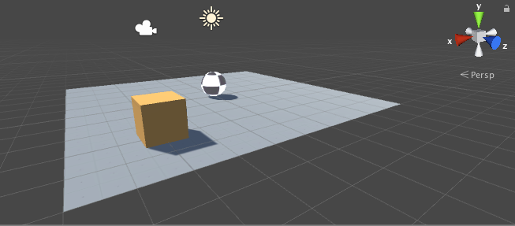
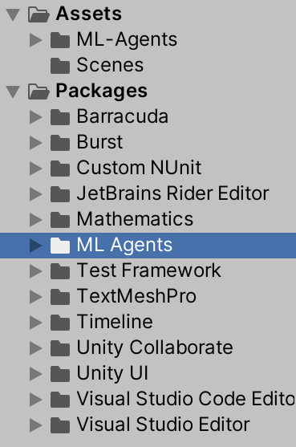
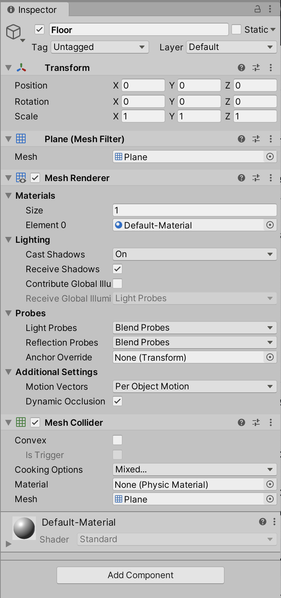
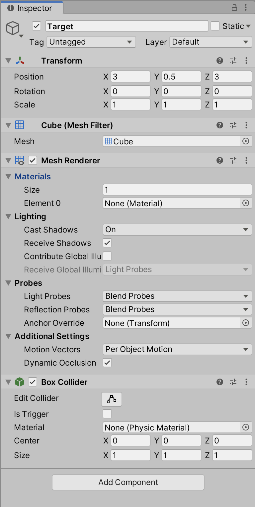
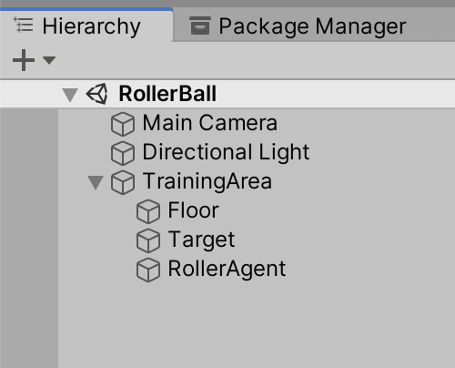
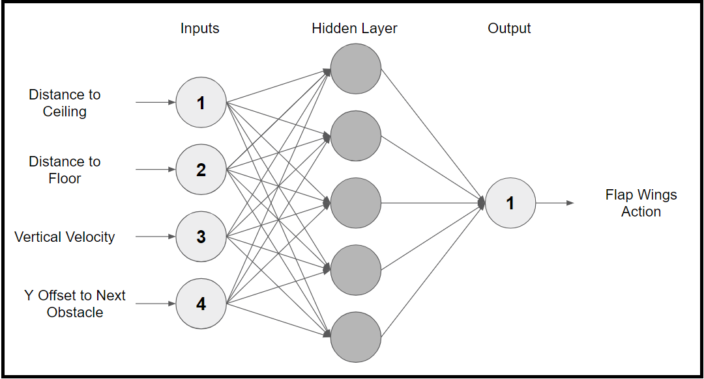
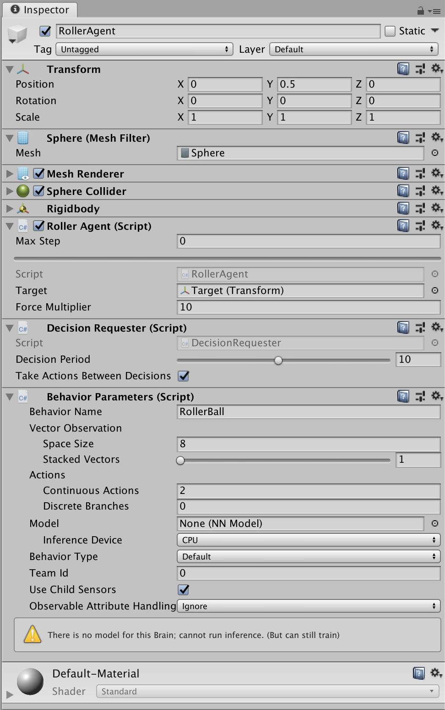
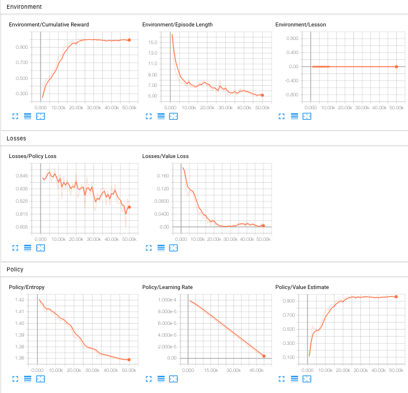

# Making a New Learning Environment(새 학습 환경 만들기)

이 튜토리얼은 새로운 Unity 환경을 처음부터 만드는 과정을 안내합니다.
이미 구축된 환경에서 먼저 개념을 이해하기 위해 [Getting Started](Getting-Started.md) 가이드를 읽어보시기를 권장합니다.



이 예제에서는 플랫폼 위의 공을 제어할 수 있는 에이전트를 만들 것입니다.
이 후 에이전트를 훈련시켜 공을 큐브 쪽으로 굴리되, 플랫폼에서 떨어지지 않도록 하는 방법을 학습하게 할 것 입니다.

## Overview(개요)

Unity 프로젝트에서 ML-Agents Toolkit을 사용하는 기본 단계는 다음과 같습니다:

1. 에이전트가 있을 환경을 만듭니다.
   환경은 몇 개의 객체가 포함된 간단한 물리 시뮬레이션에서부터 전체 게임이나 생태계까지 다양할 수 있습니다.
1. 에이전트 하위 클래스를 구현합니다. 에이전트 하위 클래스는 에이전트가 환경을 관찰하고, 주어진 행동을 수행하며,
   강화 학습을 위한 보상을 계산하는 코드를 정의합니다.
   또한, 에이전트가 작업을 완료했거나 실패했을 때 이를 리셋하는 선택적 메서드를 구현할 수 있습니다.
1. 에이전트 하위 클래스를 적절한 게임 오브젝트에 추가합니다.
   보통, 시뮬레이션에서 에이전트를 나타내는 객체에 추가됩니다.

**Note:** Unity에 익숙하지 않은 경우, 이 튜토리얼에서 에디터 작업이 충분히 설명되지 않은 경우에는 [Unity manual](https://docs.unity3d.com/Manual/index.html)을 참고하세요.

이미 설치하지 않으셨다면, [installation instructions(설치 지침)](Installation.md)을 따르세요.

## Set Up the Unity Project(Unity 프로젝트 설정)

첫 번째 작업은 새로운 Unity 프로젝트를 만들고 ML-Agents 자산을 가져오는 것입니다:

1. **Unity Hub**를 실행하고 "RollerBall"이라는 이름으로 새로운 3D 프로젝트를 만듭니다.
2. [Add the ML-Agents Unity package(ML-Agents Unity 패키지 추가](Installation.md#install-the-comunityml-agents-unity-package)
   하여 프로젝트에 ML-Agents를 설치합니다.

이제 Unity **Project** 창에서 다음 자산을 확인할 수 있어야 합니다:

<p align="center">
  
</p>

## Create the Environment(환경 만들기)

다음으로, 학습 환경 역할을 할 매우 간단한 씬을 만들겠습니다.
환경의 "물리적" 구성 요소에는 에이전트가 움직일 수 있는 바닥 역할을 하는 `Plane`, 에이전트가 목표로 삼을 `Cude`,
그리고 에이전트를 나타내는 `Sphere`가 포함됩니다.
이제 이러한 요소들을 Unity 씬에 추가하는 방법을 설명하겠습니다.

### Create the Floor Plane(바닥 Plane 생성하기)

1. `Hierarchy` 창에서 마우스 오른쪽 클릭하고 `3D Object > Plane`을 선택합니다.
2. 생성된 Plane 객체의 이름을 **Floor**로 변경합니다.
3. Floor 객체를 선택한 후, `Inspector` 창에서 `Transform` 컴포넌트의 값을 아래와 같이 설정합니다:
   - **Position** = `(0, 0, 0)`
   - **Rotation** = `(0, 0, 0)`
   - **Scale** = `(1, 1, 1)`

이렇게 하면 Agent가 움직일 수 있는 바닥 Plane이 준비됩니다.

<p align="center">
  
</p>

### Add the Target Cube(목표 Cude 추가하기)

1. `Hierarchy` 창에서 마우스 오른쪽 클릭하고 `3D Object > Cube`을 선택합니다.
2. 새로 생성된 Cube 객체의 이름을 **Target**으로 변경합니다.
3. Target 객체를 선택한 후, `Inspector` 창에서 `Transform` 컴포넌트의 값을 아래와 같이 설정합니다:
   - **Position** = `(3, 0.5, 3)`
   - **Rotation** = `(0, 0, 0)`
   - **Scale** = `(1, 1, 1)`

이 Cube는 에이전트가 목표로 삼을 대상입니다.

<p align="center">
  
</p>

### Add the Agent Sphere(에이전트 구체 추가하기)

1. `Hierarchy` 창에서 마우스 오른쪽 클릭하고 `3D Object > Sphere`를 선택합니다.
2. 새로 생성된 Sphere 객체의 이름을 **RollerAgent**으로 변경합니다.
3. RollerAgent 객체를 선택한 후, `Inspector` 창에서 `Transform` 컴포넌트의 값을 아래와 같이 설정합니다:
   - **Position** = `(0, 0.5, 0)`
   - **Rotation** = `(0, 0, 0)`
   - **Scale** = `(1, 1, 1)`
1. `Inspector` 창에서 `Add Component` 버튼을 클릭합니다.
1. RollerAgent 객체에 `Rigidbody` 컴포넌트를 추가합니다.

### Group into Training Area(Training Area로 그룹화하기)

Floor, Target 그리고 RollerAgent를 하나의 빈 GameObject 아래에 그룹화하세요.
이렇게 하면 이 후 단계들이 더 간단해질 것입니다.

다음을 수행하세요:

1. 프로젝트 `Hierarchy` 창에서 마우스 오른쪽 클릭하여 `빈 GameObject`를 생성합니다.
   이 GameObject의 이름을 **TrainingArea**로 지정합니다.
1. RollerAgent 객체를 선택한 후, `Inspector` 창에서 `Transform` 컴포넌트을 **초기화**하여 아래와 같이 설정합니다.
   - **Position** = `(0, 0, 0)`
   - **Rotation** = `(0, 0, 0)`
   - **Scale** = `(1, 1, 1)`
1. `Hierarchy` 창에서 Floor, Target 그리고 RollerAgent GameObject들을
   TrainingArea GameObject로 **드래그**하여 자식(하위 요소)으로 추가합니다.

<p align="center">
  
</p>

## Implement an Agent(에이전트 구현)

에이전트 스크립트를 만들기 위해:

1. **RollerAgent** 게임 오브젝트를 선택하여 인스펙터 창에서 확인합니다.
2. **Add Component**를 클릭합니다.
3. 컴포넌트 목록 하단에서 **New Script**를 클릭합니다.
4. 스크립트의 이름을 **RollerAgent**로 지정합니다.
5. **Create and Add**를 클릭합니다.

그런 다음 새로운 `RollerAgent` 스크립트를 수정합니다:

1. Unity `Project` 창에서 `RollerAgent` 스크립트를 더블 클릭하여 코드 편집기에서 엽니다.
2. ML-Agents 패키지를 가져오기 위해 파일 상단에 다음 코드를 추가합니다.

   ```csharp
   using Unity.MLAgents;
   using Unity.MLAgents.Sensors;
   using Unity.MLAgents.Actuators;
   ```

   그런 다음 `MonoBehaviour`를 `Agent`로 기본 클래스를 변경합니다.
1. `Update()` 메서드를 삭제하고 `Start()` 메서드는 그대로 둡니다. `Start()`는 초기 설정에만 사용되므로 삭제할 필요는 없습니다.

지금(여기)까지는 ML-Agent를 Unity 프로젝트에 추가하는 기본적인 단계들을 다뤘습니다.
다음으로는 에이전트가 강화 학습을 사용하여 큐브로 굴러가는 방법을 배우게 할 논리를 추가할 것입니다.
구체적으로, 우리는 `Agent` 기본 클래스에서 세 가지 메서드를 확장해야 합니다:

- `OnEpisodeBegin()`
- `CollectObservations(VectorSensor sensor)`
- `OnActionReceived(ActionBuffers actionBuffers)`

각 각의 메서드에 대해서는 아래의 전용 섹션에서 더 자세히 설명할 것입니다.

### Initialization and Resetting the Agent(에이전트 초기화 및 리셋)

ML-Agents Toolkit에서 훈련 과정은 에이전트(Sphere)가 작업을 해결하려고 시도하는 에피소드를 실행하는 방식으로 진행됩니다.
각 에피소드는 **1) 에이전트가 작업을 해결할 때(즉, 큐브에 도달)**, **2) 실패할 때(플랫폼에서 떨어짐)**, 
또는 **3)시간 초과가 발생할 때(작업을 해결하거나 실패하는 데 너무 오래 걸림)** 까지 지속됩니다.
각 에피소드가 시작될 때 `OnEpisodeBegin()`이 호출되어 새로운 에피소드를 위한 환경을 설정합니다.
일반적으로, 에이전트가 다양한 조건에서 작업을 해결할 수 있도록 장면(환경)은 무작위로 초기화됩니다.

이 예제에서는 에이전트(Sphere)가 목표(Cube)에 도달할 때마다 에피소드가 끝나고, 목표(Cube)는 새로운 무작위 위치로 이동합니다.
만약 에이전트가 플랫폼에서 떨어지면, 에이전트는 바닥으로 다시 놓이게 됩니다.
이러한 모든 동작은 `OnEpisodeBegin()`에서 처리됩니다.

목표(Cube)를 이동시키려면, 해당 목표의 Transform(3D 세계에서 GameObject의 위치, 방향, 크기를 저장하는 클래스)에 대한 참고가 필요합니다.
이를 위해, **RollerAgent** 클래스에 `Transform` 유형의 public 필드를 추가하세요.
Unity에서 컴포넌트의 public 필드는 인스펙터 창에 표시되며, 이를 통해 Unity 에디터에서 어떤 GameObject를 목표로 사용할지 선택할 수 있습니다.

에이전트의 속도를 초기화하고(그리고 이 후 에이전트를 이동시키기 위해 힘을 가하기 위해) Rigidbody 컴포넌트에 대한 참조가 필요합니다.
[Rigidbody](https://docs.unity3d.com/ScriptReference/Rigidbody.html)는 주요 물리 시뮬레이션 요소입니다. (Unity 물리에 대한 전체 문서는 [Physics](https://docs.unity3d.com/Manual/PhysicsSection.html)에서 확인할 수 있습니다.)
Rigidbody 컴포넌트가 에이전트 스크립트와 동일한 GameObject에 있기 때문에, 이 참조를 얻는 가장 좋은 방법은
`GameObject.GetComponent<T>()`를 사용하는 것입니다. 이를 스크립트의 `Start()` 메서드에서 호출할 수 있습니다.

현재까지, 우리의 **RollerAgent** 스크립트는 다음과 같습니다:

```csharp
using System.Collections.Generic;
using UnityEngine;
using Unity.MLAgents;
using Unity.MLAgents.Sensors;

public class RollerAgent : Agent
{
    Rigidbody rBody;
    void Start () {
        rBody = GetComponent<Rigidbody>();
    }

    public Transform Target;
    public override void OnEpisodeBegin()
    {
       // If the Agent fell, zero its momentum
        if (this.transform.localPosition.y < 0)
        {
            this.rBody.angularVelocity = Vector3.zero;
            this.rBody.velocity = Vector3.zero;
            this.transform.localPosition = new Vector3( 0, 0.5f, 0);
        }

        // Move the target to a new spot
        Target.localPosition = new Vector3(Random.value * 8 - 4,
                                           0.5f,
                                           Random.value * 8 - 4);
    }
}
```

다음으로, `Agent.CollectObservations(VectorSensor sensor)` 메서드를 구현해 봅시다.

### Observing the Environment(환경 관찰하기)

에이전트(Agent)는 우리가 수집한 정보를 `브레인(Brain)`으로 보내고, `브레인(Brain)`은 이를 사용하여 결정을 내립니다.
에이전트를 훈련할 때(또는 훈련된 모델을 사용할 때) 이 데이터는 `피처 벡터(feature vector)`로서 `신경망(neural network)`에 입력됩니다.
에이전트가 과제를 성공적으로 학습하려면 올바른 정보를 제공해야 합니다. 수집할 정보를 결정하는 좋은 기준은 문제에 대한 분석적 해법을
계산하기 위해 필요한 정보가 무엇일지를 고려하는 것입니다.

**note :**
- **브레인(Brain)** 은 ML-Agent 툴킷에서 에이전트의 행동을 결정하는 핵심 역할을 하는 요소입니다.
  브레인은 에이전트가 주위 환경에서 얻은 관찰 데이터를 바탕으로 신경망(neural network)을 사용하여 다음 행동을 선택합니다.
- **피처 벡터(feature vector)** 은 에이전트가 환경을 관찰하여 수집한 데이터를 하나의 벡터 형태로 표현한 것입니다.
  이 벡터는 신경망(neural network)의 입력으로 사용되어 에이전트가 다음에 수행할 행동을 결정할 때 중요한 역할을 합니다.
- **신경망(neural network)** 은 에이전트가 학습을 통해 특정 과제를 수행하도록 돕는 중요한 도구입니다.
  신경망은 인간의 뇌 구조에서 영감을 받아 설계된 수학적 모델로, 여러 개의 뉴런(노드)들이 서로 연결되어 계층 구조를 이루고 있습니다.
  ML-Agents와 같은 강화 학습 시스템에서 신경망의 주요 역할은 에이전트가 환경에서 수집한 데이터를 입력으로 받아 이를 학습하여,
  주어진 환경에서 최적의 행동을 선택할 수 있도록 하는 것입니다. 구체적으로, 신경망은 피처 벡터를 입력으로 받아 학습한 결과를 바탕으로
  에이전트가 다음에 취할 행동을 출력으로 제공합니다.
  신경망은 크게 `입력층`, `숨겨진 층(중간층)`, `출력층`으로 구성됩니다:
  1. 입력층 : 환경에서 수집한 피처 벡터를 입력으로 받습니다.
  2. 숨겨진 층(중간층) : 입력층과 출력층 사이에 위치하여 다양한 계산을 수행합니다. 이 층에서 뉴런들이 서로 연결되며 학습 과정에서 패턴을 찾고,
     중요한 특징을 추출하는 역할을 합니다.
  3. 출력층 : 에이전트가 취할 행동을 결정하는 값들이 나옵니다. 이 값은 에이전트가 강화 학습 과정에서 학습한 내용을 바탕으로,
     현재 상태에서 가장 최적이라고 판단되는 행동입니다. 
  <p align="center">
  
       Extract:https://www.alexmasse.com/blog/2018/5/21/unity-3d-flappy-bird-ai-with-machine-learning 
</p>

에이전트가 수집하는 정보는 `목표물의 위치`, `에이전트 자신의 위치` 그리고 `에이전트의 속도`를 포함합니다.
이를 통해 에이전트는 자신의 속도를 조절하여 목표물을 지나치지 않고 플랫폼에서 떨어지지 않도록 학습할 수 있습니다.
다음과 같이 구현된 에이전트 관측은 총 8개의 값을 포함합니다.

```csharp
public override void CollectObservations(VectorSensor sensor)
{
    // Target and Agent positions
    sensor.AddObservation(Target.localPosition);
    sensor.AddObservation(this.transform.localPosition);

    // Agent velocity
    sensor.AddObservation(rBody.velocity.x);
    sensor.AddObservation(rBody.velocity.z);
}
```

### Taking Actions and Assigning Rewards(행동 수행 및 보상 할당)

Agent 코드의 마지막 부분은 `Agent.OnActionReceived()` 메서드로, 이 메서드는 행동을 받아들이고 보상을 할당합니다.

#### Actions(행동)

과제를 해결하기 위해, 즉 목표를 향해 이동하기 위해 에이전트(Sphere)는 `x` 및 `z` 방향으로 이동할 수 있어야 합니다.
따라서 에이전트는 2개의 행동이 필요합니다.
**첫 번째** 행동은 x축을 따라 적용되는 힘을 결정하고, **두 번째** 행동은 z축을 따라 적용되는 힘을 결정합니다.
(만약 에이전트가 3차원에서 이동할 수 있도록 한다면, 세 번째 행동도 필요하게 됩니다.)

RollerAgent는 `action[]` 배열의 값을 Rigidbody 구성 요소인 `rBody`에 `Rigidbody.AddForce()`를 사용하여 적용합니다:

```csharp
Vector3 controlSignal = Vector3.zero;
controlSignal.x = action[0];
controlSignal.z = action[1];
rBody.AddForce(controlSignal * forceMultiplier);
```

#### Rewards(보상)

강화 학습에서는 보상을 통해 어떤 결정이 좋은지 나쁜지를 알립니다.
학습 알고리즘은 보상을 사용하여 에이전트에게 최적의 행동을 제시하고 있는지 판단합니다.
에이전트가 주어진 작업을 완료했을 때 보상을 주는 것이 좋습니다. 이 경우, 에이전트가 목표 큐브에 도달하면 1.0의 보상을 받습니다.

보상은 `OnActionReceived()` 메서드에서 할당됩니다.
RollerAgent는 목표에 도달 했을 때 감지하기 위해 거리를 계산합니다. 
목표에 도달하면 코드에서 `Agent.SetReward()`를 호출하여 1.0의 보상을 할당하고 
`EndEpisode()`를 호출하여 에이전트를 종료 상태로 표시합니다.

```csharp
float distanceToTarget = Vector3.Distance(this.transform.localPosition, Target.localPosition);
// Reached target
if (distanceToTarget < 1.42f)
{
    SetReward(1.0f);
    EndEpisode();
}
```

마지막으로, 에이전트가 플랫폼에서 떨어진 에피소드를 종료하여 에이전트가 스스로 초기화할 수 있도록 합니다:

```csharp
// Fell off platform
if (this.transform.localPosition.y < 0)
{
    EndEpisode();
}
```

#### OnActionReceived()

위에서 설명한 액션 및 보상 로직을 바탕으로 `OnActionReceived()`의 최종 버전은 다음과 같습니다:

```csharp
public float forceMultiplier = 10;
public override void OnActionReceived(ActionBuffers actionBuffers)
{
    // Actions, size = 2
    Vector3 controlSignal = Vector3.zero;
    controlSignal.x = actionBuffers.ContinuousActions[0];
    controlSignal.z = actionBuffers.ContinuousActions[1];
    rBody.AddForce(controlSignal * forceMultiplier);

    // Rewards
    float distanceToTarget = Vector3.Distance(this.transform.localPosition, Target.localPosition);

    // Reached target
    if (distanceToTarget < 1.42f)
    {
        SetReward(1.0f);
        EndEpisode();
    }

    // Fell off platform
    else if (this.transform.localPosition.y < 0)
    {
        EndEpisode();
    }
}
```

`forceMultiplier` 클래스 변수는 `OnActionReceived()` 메소드 정의 전에 정의되어 있으며,
이는 에이전트가 적용하는 힘의 크기를 조절하는 데 사용됩니다.
`forceMultiplier`가 public으로 선언되어 있으므로, Unity의 Inspector 창에서 값을 설정할 수 있습니다.

## Final Agent Setup in Editor(에디터에서 최종 에이전트 설정)

모든 게임 오브젝트와 ML-Agent 구성 요소가 준비되었으므로, Unity 에디터에서 모든 것을 연결할 차례입니다.
이 과정에서는 에이전트 스크립트와 호환되도록 에이전트 구성 요소의 속성을 추가하고 설정하는 작업이 필요합니다.

1. **RollerAgent** GameObject를 선택하여 Inspector 창에서 속성을 표시합니다.
2. `Target` GameObject를 Hierarchy에서 드래그하여 RollerAgent 스크립트의 `Target` 필드에 넣습니다(할당합니다).
3. **Add Component** 버튼을 사용하여 `Decision Requester`스크립트를 추가합니다. 이후 **Decision Period** 필드의 값을 `10`으로 설정합니다. `Decisions`에 관한 자세한 내용은 [the Agent documentation](Learning-Environment-Design-Agents.md#decisions)를 참고하세요.
4. **Add Component** 버튼을 클릭하여 `Behavior Parameters` 스크립트를 추가하고, 아래와 같이 에이전트의 행동 매개변수를 설정합니다:
   - `Behavior Name`: _RollerBall_
   - `Vector Observation` > `Space Size` = 8
   - `Actions` > `Continuous Actions` = 2   

Inspector에서 `RollerAgent`는 이제 다음과 같아야 합니다:

  <p align="center">
  
</p>

이제 훈련 전에 환경을 테스트할 준비가 되었습니다.

**note:**
- **Decision Requester**는 Unity ML-Agents Toolkit에서 사용되는 컴포넌트로 에이전트가 주기적으로 의사 결정을 내리도록 요청하는 역할을 합니다. 이 컴포넌트는 에이전트가 훈련 중에 언제 의사 결정을 내릴지 지정하는데 사용됩니다. 기본적으로, 훈련된 에이전트는 환경에서 관찰한 정보를 바탕으로 행동을 선택하게 되는데, `Decision Requester`는 그 시점이 언제인지 정하는 역할을 합니다.
- **Decision Period**는 속성으로서 에이전트가 얼마나 자주 결정을 내릴지를 설정합니다. 예를 들어 값을 10으로 설정하면, 에이전트는 10프레임마다 한 번씩 행동을 결정합니다. 이는 훈련이 더 빠르게 진행될 수 있도록 설정할 수 있는 중요한 값입니다.
- **Behavior Parameters**는 Unity ML-Agents Toolkit에서 사용되는 중요한 컴포넌트로 에이전트의 행동 방식과 훈련 환경을 설정하는 역할을 합니다. 이 컴포넌트를 통해 에이전트가 학습하는 방식을 제어하고, 신경망 모델의 입력과 출력을 정의 할 수 있습니다.
- **Behavior Name**는 속성으로서 에이전트의 행동 이름을 설정하는 필드입니다. 이 이름은 훈련 중에 사용되는 모델의 이름과 연결됩니다. 예를 들어, `RollerBall`이라고 설정하면, 훈련된 모델이 이 이름으로 저장되고 사용됩니다.
- **Vector Observation**는 에이전트가 환경을 관찰할 때 사용할 벡터 형태의 입력 데이터를 설정하는 부분입니다. `Space Size`는 에이전트가 관찰하는 상태 벡터의 크기를 정의합니다. 예를 들어 `Space Size = 8`로 설정하면, 에이전트는 8개의 값(위치, 속도 등)을 관찰하고, 이 값들을 신경망에 입력으로 제공합니다.
- **Actions**는 에이전트가 수행할 수 있는 행동을 정의합니다. `Continuous Actions`는(은) 연속적인 행동을 수행하는 경우, 예를 들어 `2`로 설정하면, 에이전트가 두 개의 연속적인 값을 기반으로 행동을 결정하도록 훈련합니다. 각 행동은 `x`축과 `z`축 방향으로의 힘을 적용하는 방식으로 정의할 수 있습니다. 

## Testing the Environment

It is always a good idea to first test your environment by controlling the Agent
using the keyboard. To do so, you will need to extend the `Heuristic()` method
in the `RollerAgent` class. For our example, the heuristic will generate an
action corresponding to the values of the "Horizontal" and "Vertical" input axis
(which correspond to the keyboard arrow keys):

```csharp
public override void Heuristic(in ActionBuffers actionsOut)
{
    var continuousActionsOut = actionsOut.ContinuousActions;
    continuousActionsOut[0] = Input.GetAxis("Horizontal");
    continuousActionsOut[1] = Input.GetAxis("Vertical");
}
```

In order for the Agent to use the Heuristic, You will need to set the
`Behavior Type` to `Heuristic Only` in the `Behavior Parameters` of the
RollerAgent.

Press **Play** to run the scene and use the arrows keys to move the Agent around
the platform. Make sure that there are no errors displayed in the Unity Editor
Console window and that the Agent resets when it reaches its target or falls
from the platform.

## Training the Environment

The process is the same as described in the
[Getting Started Guide](Getting-Started.md).

The hyperparameters for training are specified in a configuration file that you
pass to the `mlagents-learn` program. Create a new `rollerball_config.yaml` file
under `config/` and include the following hyperparameter values:

```yml
behaviors:
  RollerBall:
    trainer_type: ppo
    hyperparameters:
      batch_size: 10
      buffer_size: 100
      learning_rate: 3.0e-4
      beta: 5.0e-4
      epsilon: 0.2
      lambd: 0.99
      num_epoch: 3
      learning_rate_schedule: linear
      beta_schedule: constant
      epsilon_schedule: linear
    network_settings:
      normalize: false
      hidden_units: 128
      num_layers: 2
    reward_signals:
      extrinsic:
        gamma: 0.99
        strength: 1.0
    max_steps: 500000
    time_horizon: 64
    summary_freq: 10000
```

Hyperparameters are explained in [the training configuration file documentation](Training-Configuration-File.md)

Since this example creates a very simple training environment with only a few
inputs and outputs, using small batch and buffer sizes speeds up the training
considerably. However, if you add more complexity to the environment or change
the reward or observation functions, you might also find that training performs
better with different hyperparameter values. In addition to setting these
hyperparameter values, the Agent **DecisionFrequency** parameter has a large
effect on training time and success. A larger value reduces the number of
decisions the training algorithm has to consider and, in this simple
environment, speeds up training.

To train your agent, run the following command before pressing **Play** in the
Editor:

    mlagents-learn config/rollerball_config.yaml --run-id=RollerBall

To monitor the statistics of Agent performance during training, use
[TensorBoard](Using-Tensorboard.md).



In particular, the _cumulative_reward_ and _value_estimate_ statistics show how
well the Agent is achieving the task. In this example, the maximum reward an
Agent can earn is 1.0, so these statistics approach that value when the Agent
has successfully _solved_ the problem.

## Optional: Multiple Training Areas within the Same Scene

In many of the [example environments](Learning-Environment-Examples.md), many
copies of the training area are instantiated in the scene. This generally speeds
up training, allowing the environment to gather many experiences in parallel.
This can be achieved simply by instantiating many Agents with the same
`Behavior Name`. Note that we've already simplified our transition to using
multiple areas by creating the `TrainingArea` GameObject and relying on local
positions in `RollerAgent.cs`. Use the following steps to parallelize your
RollerBall environment:

1. Drag the TrainingArea GameObject, along with its attached GameObjects, into
   your Assets browser, turning it into a prefab.
1. You can now instantiate copies of the TrainingArea prefab. Drag them into
   your scene, positioning them so that they do not overlap.

Alternatively, you can use the `TrainingAreaReplicator` to replicate training areas. Use the following steps:

1. Create a new empty Game Object in the scene.
2. Click on the new object and add a TrainingAreaReplicator component to the empty Game Object through the inspector.
3. Drag the training area to `Base Area` in the Training Area Replicator.
4. Specify the number of areas to replicate and the separation between areas.
5. Hit play and the areas will be replicated automatically!

## Optional: Training Using Concurrent Unity Instances
Another level of parallelization comes by training using
[concurrent Unity instances](ML-Agents-Overview.md#additional-features).
For example,

```
mlagents-learn config/rollerball_config.yaml --run-id=RollerBall --num-envs=2
```

will start ML Agents training with two environment instances. Combining multiple
training areas within the same scene, with concurrent Unity instances, effectively
gives you two levels of parallelism to speed up training. The command line option
`--num-envs=<n>` controls the number of concurrent Unity instances that are
executed in parallel during training.
