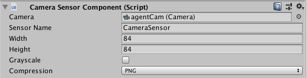
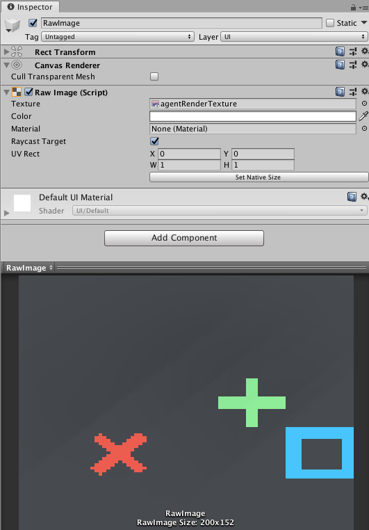
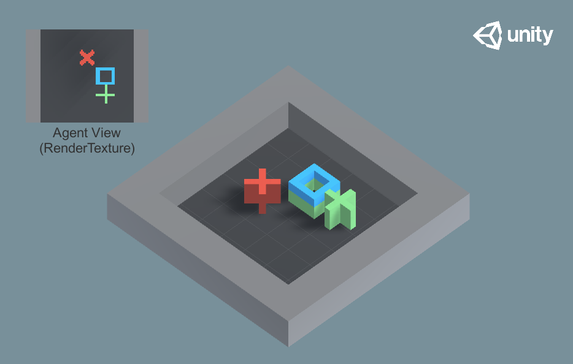
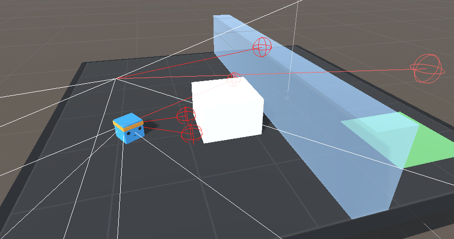
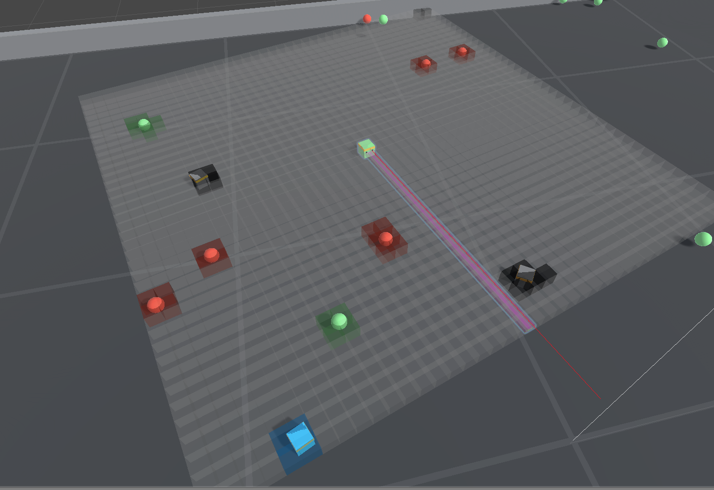
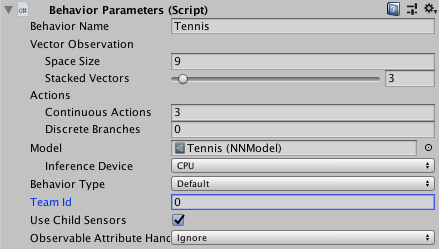
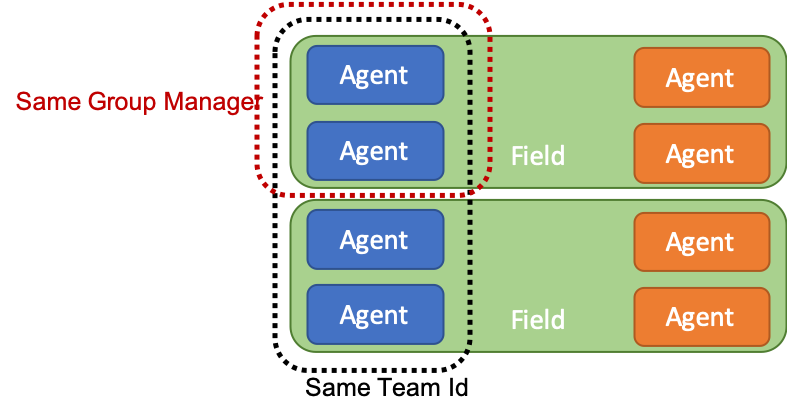
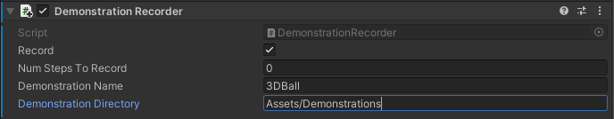
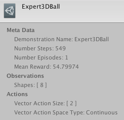

# Agents

**Table of Contents:**

- [Decisions](#decisions)
- [Observations and Sensors](#observations-and-sensors)
  - [Generating Observations](#generating-observations)
    - [Agent.CollectObservations()](#agentcollectobservations)
    - [Observable Fields and Properties](#observable-fields-and-properties)
    - [ISensor interface and SensorComponents](#isensor-interface-and-sensorcomponents)
  - [Vector Observations](#vector-observations)
    - [One-hot encoding categorical information](#one-hot-encoding-categorical-information)
    - [Normalization](#normalization)
    - [Stacking](#stacking)
    - [Vector Observation Summary & Best Practices](#vector-observation-summary--best-practices)
  - [Visual Observations](#visual-observations)
    - [Visual Observation Summary & Best Practices](#visual-observation-summary--best-practices)
  - [Raycast Observations](#raycast-observations)
    - [RayCast Observation Summary & Best Practices](#raycast-observation-summary--best-practices)
  - [Variable Length Observations](#variable-length-observations)
    - [Variable Length Observation Summary & Best Practices](#variable-length-observation-summary--best-practices)
  - [Goal Signal](#goal-signal)
    - [Goal Signal Summary & Best Practices](#goal-signal-summary--best-practices)
- [Actions and Actuators](#actions-and-actuators)
  - [Continuous Actions](#continuous-actions)
  - [Discrete Actions](#discrete-actions)
    - [Masking Discrete Actions](#masking-discrete-actions)
  - [Actions Summary & Best Practices](#actions-summary--best-practices)
- [Rewards](#rewards)
  - [Examples](#examples)
  - [Rewards Summary & Best Practices](#rewards-summary--best-practices)
- [Agent Properties](#agent-properties)
- [Destroying an Agent](#destroying-an-agent)
- [Defining Multi-agent Scenarios](#defining-multi-agent-scenarios)
  - [Teams for Adversarial Scenarios](#teams-for-adversarial-scenarios)
  - [Groups for Cooperative Scenarios](#groups-for-cooperative-scenarios)
- [Recording Demonstrations](#recording-demonstrations)

에이전트(Agent)는 환경을 관찰하고, 그 관찰을 바탕으로 최적의 행동을 결정하여 이를 실행하는 존재입니다.
Unity에서는 `Agent` 클래스를 확장하여 에이전트를 생성할 수 있습니다.
에이전트를 성공적으로 학습시키기 위해 가장 중요한 요소는 에이전트가 수집하는 **관찰 데이터(observations)** 와
에이전트의 현재 상태가 주어진 작업을 달성하는 데 얼마나 유용한지를 평가하는 **보상 값(reward)** 입니다.

에이전트는 자신의 관찰 데이터를 **정책(Policy)** 에 전달합니다.
`정책(Policy)`은 이 데이터를 기반으로 결정을 내리고, 선택한 행동을 에이전트에게 다시 전달합니다.
에이전트 코드는 이 행동을 수행해야 하며, 예를 들어 에이전트를 특정 방향으로 이동시키는 작업을 포함할 수 있습니다.
에이전트를 [강화 학습을 통해 학습시키기](Learning-Environment-Design.md) 위해서는
에이전트가 각 행동에서 `보상 값(reward)`을 계산해야 합니다.
이 보상은 최적의 의사 결정 `정책(Policy)`을 찾는데 사용됩니다.

`Policy` 클래스는 에이전트의 의사 결정 로직을 에이전트 자체로부터 분리하여,
여러 에이전트에서 동일한 정책을 사용할 수 있도록 합니다. 정책이 결정을 내리는 방식은 에이전트에 연관된 `Behavior Parameters`에 따라 달라집니다.
만약 `Behavior Type`을 `Heuristic Only`로 설정하면, 에이전트는 `Heuristic()` 메서드를 사용하여 결정을 내리며,
이를 통해 수동으로 에이전트를 제어하거나 사용자 지정 정책을 작성할 수 있습니다.
에이전트에 `Model` 파일이 있는 경우, 정책은 신경망 `Model`을 사용하여 결정을 내리게 됩니다.

에이전트를 생성할 때는 일반적으로 기본 `Agent` 클래스를 확장해야 합니다.
이 과정에서 다음 메서드들을 구현해야 합니다 :

- `Agent.OnEpisodeBegin()` — 에이전트의 에피소드 시작 시 호출되며, 시뮬레이션 시작 시에도 호출됩니다.
- `Agent.CollectObservations(VectorSensor sensor)` — 에이전트가 결정을 요청할 때마다 호출됩니다.
  이 메서드는 환경에 대한 에이전트의 관찰을 수집하는 한 가지 방법으로,
  다른 방법에 대해서는 [Generating Observations(관찰 생성)](#generating-observations)에서 확인할 수 있습니다.
- `Agent.OnActionReceived()` — 에이전트가 실행할 액션을 받을 때마다 호출됩니다.
  에이전트가 선택한 액션을 받고, 이 메서드에서 보상을 할당하는 것도 일반적입니다.
- `Agent.Heuristic()` - 에이전트의 `Behavior Parameters`에서 `Behavior Type`이 `Heuristic Only`로 설정되면,
  에이전트는 `Heuristic()` 메서드를 사용하여 액션을 생성합니다.
  이 경우, `Heuristic()` 메서드는 인자로 제공된 floats 배열에 액션을 작성해야 합니다. 
   __Note__: `Heuristic()` 메서드에서 새 float 배열을 생성하지 마세요. 그렇게 하면 원래의 액션 배열에 float을 작성하는 것을 방해 할 수 있습니다.

구체적인 예로, 다음은 Ball3DAgent 클래스가 이러한 메서드를 구현하는 방식입니다:

- `Agent.OnEpisodeBegin()` — 이 메서드는 에이전트 큐브와 공을 시작 위치로 재설정합니다.
  훈련이 특정 시작 위치나 에이전트 큐브의 방향에 종속되지 않고 일반화되도록 재설정 값이 무작위로 설정됩니다.
- `Agent.CollectObservations(VectorSensor sensor)` — 에이전트 큐브의 방향,
  공의 속도, 그리고 공과 큐브 사이의 상대적인 위치 정보를 수집하여 `VectorSensor.AddObservation()`을 통해 추가합니다.
  `CollectObservations()` 메서드가 8개의 벡터 크기를 더해 관측 데이터를 생성하므로,
  이 에이전트의 `Behavior Parameters`에서는 상태 크기를 8로 설정하여 벡터 관측 공간을 정의합니다.
- `Agent.OnActionReceived()` — 이 메서드는 에이전트 큐브의 회전에 작은 변화를 일으킵니다.
  예제에서는 에이전트가 공을 큐브 위에 유지하는 동안에는 단계마다 작은 긍정적 보상을 받으며,
  공을 떨어뜨리면 큰 부정적 보상을 받습니다.
  공을 떨어뜨릴 경우 에피소드가 종료되며, 이 후 새로운 공으로 다음 시뮬레이션 단계가 시작됩니다.
- `Agent.Heuristic()` - 키보드 입력을 액션으로 변환하여 수동 제어가 가능하게 합니다.

## Decisions(결정)

**관찰(observation)-결정(decision)-행동(action)-보상(reward)** 주기는 에이전트가 결정을 요청할 때마다 반복됩니다.
에이전트가 결정을 요청하려면 `Agent.RequestDecision()`을 호출합니다.
에이전트가 일정한 간격으로 스스로 결정을 요청하도록 하려면, 에이전트의 GameObject에 `Decision Requester` 컴포넌트를 추가하세요.

일정한 스텝 간격으로 결정을 내리는 것은 일반적으로 물리 기반 시뮬레이션에 적합합니다.
예를 들어, 관절 토크를 세밀하게 조정해야 하는 로봇 시뮬레이터에서 에이전트는 시뮬레이션의 모든 스텝마다 결정을 내려야 합니다.
실시간 전략 게임과 같이 여러 에이전트가 정기적으로 결정을 내려야 하는 경우, 각 에이전트의 `Decision Requester` 컴포넌트의
`DecisionStep` 매개변수를 설정하여 결정을 내리는 타이밍을 시차를 두고 조정할 수 있습니다.
반면에 턴제 게임처럼 특정 게임 또는 시뮬레이션 이벤트가 발생할 때만 결정을 내려야 하는 에이전트는 `Agent.RequestDecision()`을 
수동으로 호출하는 것이 적절합니다.

## Observations and Sensors(관찰과 센서)
에이전트가 학습하려면, 관찰에는 에이전트가 자신의 임무를 수행하는데 필요한 모든 정보가 포함되어야 합니다.
충분하고 관련성 있는 정보가 없다면, 에이전트는 제대로 학습하지 못하거나 전혀 학습하지 못할 수 있습니다.
어떤 정보를 포함시켜야 하는지 결정하는 합리적인 방법은 문제에 대한 분석적 해결책을 계산하는데 필요한 정보 또는 
인간이 문제를 해결하기 위해 사용할 수 있을 것으로 예상되는 정보를 고려하는 것입니다.

예를 들어, 게임에서 캐릭터가 목표를 추적하는 작업을 수행해야 한다면 그 캐릭터의 현재 위치, 목표의 위치, 
장애물의 위치 등과 같은 정보는 중요한 관찰 항목이 될 수 있습니다.
이를 통해 에이전트는 목표를 향해 효과적으로 움직이는 방법을 학습할 수 있습니다.

### Generating Observations(관찰 생성하기)
ML-Agents는 에이전트가 관찰을 생성할 수 있는 여러 가지 방법을 제공합니다:
  1. `Agent.CollectObservations()` 메서드를 재정의하여 제공된 `VectorSensor`에 관찰 데이터를 전달하는 방법.
  2. 에이전트의 필드와 속성에 `[Observable]` 속성을 추가하는 방법.
  3. 에이전트에 부착된 `SensorComponent`를 사용하여 `ISensor`를 생성하거나, 직접 `ISensor` 인터페이스를 구현하는 방법.

#### Agent.CollectObservations()
Agent.CollectObservations()는 숫자형 데이터와 비시각적 환경 측면을 다룰 때 가장 적합합니다.
에이전트의 정책(Policy) 클래스는 각 에이전트의 `CollectObservations(VectorSensor sensor)` 메서드를 호출하며,
이 메서드의 구현에서는 `VectorSensor.AddObservation`을 호출하여 벡터 관찰 데이터를 추가해야 합니다.

`VectorSensor.AddObservation` 메서드는 관찰 벡터에 일반적인 데이터 유형을 추가하기 위한 여러 오버로드를 제공합니다.
정수(Integers)와 불리언(booleans) 값을 관찰 벡터에 직접 추가할 수 있으며, `Vector2`, `Vector3`, `Quaternion`과 같은
Unity의 일반적인 데이터 유형도 추가할 수 있습니다.

다양한 상태 관찰 함수의 예는 ML-Agents SDK에 포함된 [example environments](Learning-Environment-Examples.md)을 참고할 수 있습니다. 예를 들어, 3DBall 예제에서는 플랫폼의 회전, 공의 상대적인 위치, 공의 속도를 상태 관찰로 사용합니다.

```csharp
public GameObject ball;

public override void CollectObservations(VectorSensor sensor)
{
    // Orientation of the cube (2 floats)
    sensor.AddObservation(gameObject.transform.rotation.z);
    sensor.AddObservation(gameObject.transform.rotation.x);
    // Relative position of the ball to the cube (3 floats)
    sensor.AddObservation(ball.transform.position - gameObject.transform.position);
    // Velocity of the ball (3 floats)
    sensor.AddObservation(m_BallRb.velocity);
    // 8 floats total
}
```

실험으로 공의 속도 요소를 관찰에서 제거하고 3DBall 에이전트를 다시 학습시켜 볼 수 있습니다.
속도를 사용하지 않은 경우에도 에이전트는 공을 어느 정도 균형잡아 유지하도록 학습하겠지만, 성능은 눈에 띄게 저하됩니다.

`VectorSensor.AddObservation()`에 전달되는 관찰 데이터는 항상 동일한 요소 개수를 가져야 하며, 항상 동일한 순서를 유지해야 합니다.
만약 환경 내에서 관찰해야 할 개체 수가 가변적이라면, 특정 관찰에서 누락된 개체를 0으로 채워서 데이터를 패딩하거나, 에이전트의 관찰을 고정된 하위 집합으로 제한할 수 있습니다.
예를 들어, 환경 내 모든 적을 관찰하는 대신 가장 가까운 5개의 적만 관찰하도록 설정할 수 있습니다.

추가적으로 Unity Editor에서 에이전트의 `Behavior Parameters`를 설정할 때, **Vector Observations > Space Size**를 `CollectObservations()`에서 작성되는 실수(floats)의 개수와 동일하게 설정해야 합니다.

#### Observable Fields and Properties(관찰 가능한 필드 및 속성)
또 다른 접근 방식은 관련된 관찰을 Agent 클래스의 필드나 속성으로 정의하고, 이를 `ObservableAttribute`로 주석 처리하는 것입니다.
예를 들어, Ball3DHardAgent에서 위치 차이를 관찰하기 위해 Agent에 속성을 추가할 수 있습니다:
```csharp
using Unity.MLAgents.Sensors.Reflection;

public class Ball3DHardAgent : Agent {

    [Observable(numStackedObservations: 9)]
    Vector3 PositionDelta
    {
        get
        {
            return ball.transform.position - gameObject.transform.position;
        }
    }
}
```
`ObservableAttribute`는 현재 대부분의 기본 타입(예: float, int, bool)과 `Vector2`, `Vector3`, `Vector4`, `Quaternion` 그리고 열거형(enums)을 지원합니다.

`ObservableAttribute`의 동작은 에이전트의 `Behavior Parameters`에서 "Observable Attribute
Handling" 설정에 의해 제어됩니다. 가능한 값은 다음과 같습니다 :
 * **Ignore** (default) - 에이전트의 모든 `ObservableAttribute`가 무시됩니다. 에이전트에 `ObservableAttribute`가 없다면, 이는 가장 빠른 초기화 시간을 제공합니다.
 * **Exclude Inherited** - 선언된 클래스의 멤버만 검사하고, 상속된 멤버는 무시됩니다. 이는 성능과 유연성 간의 합리적인 균형을 제공합니다.
 * **Examine All** - 클래스의 모든 맴버를 검사합니다. 이는 더 느린 시작 시간을 초래할 수 있습니다.

"Exclude Inherited"는 일반적으로 충분하지만, 에이전트가 다른 에이전트 구현을 상속받고 해당 구현에 `Observable` 맴버가 있는 경우, "Examine All"을 사용해야 합니다.

내부적으로 ObservableAttribute는 리플렉션을 사용하여 에이전트의 어떤 맴버가 ObservableAttribute를 가지고 있는지 확인하고, 또한 런타임에서 필드를 접근하거나 속성을 호출하는데 리플렉션을 사용합니다. 이는 CollectObservations나 ISensor를 사용하는 것보다 느릴 수 있지만, 성능에 눈에 띄게 영향을 미치지 않을 수 있습니다.

**NOTE**: `[Observable]` 필드나 속성을 에이전트에 추가할 때, 해당 필드나 속성의 크기는 사용되기 전에 계산될 수 있기 때문에 에이전트의 `Behavior Parameters`에서 Space Size를 조정할 필요가 없습니다.

#### ISensor interface and SensorComponents(ISensor 인터페이스와 SensorComponents)
`ISensor` 인터페이스는 일반적으로 고급 사용자용으로 설계되었습니다. `Write()` 메서드는 실제로 관찰을 생성하는 데 사용되며, 관찰의 형태를 반환하는 등의 다른 메서드도 구현해야 합니다.

`SensorComponent` 추상 클래스는 런타임에서 실제 `ISensor`를 생성하는 데 사용됩니다.
이 클래스는 `Agent`와 동일한 `GameObject` 또는 `GameObject`의 자식에 연결되어야 합니다.

API에는 여러 가지 `SensorComponents`가 제공됩니다. 이들에는 다음과 같은 종류가 있습니다 :
- `CameraSensorComponent` - `Camera`에서 이미지를 사용하여 관찰을 수행합니다.
- `RenderTextureSensorComponent` - `RenderTexture`의 콘텐츠를 관찰으로 사용합니다.
- `RayPerceptionSensorComponent` - 설정된 레이 캐스트의 정보를 관찰으로 사용합니다.
- `Match3SensorComponent` - [Match-3 game](Integrations-Match3.md)의 보드를 관찰으로 사용합니다.
- `GridSensorComponent` - 그리드 형태로 설정된 박스 쿼리를 사용하여 관찰을 수행합니다.

**NOTE**: `SensorComponents`를 사용할 때는 Agent의 `Behavior Parameters`에서 Space Size를 조정할 필요가 없습니다.

내부적으로 `Agent.CollectObservations`와 `[Observable]` 속성은 모두 ISensor를 사용하여 관찰 데이터를 기록합니다. 그러나 이는 대부분 사용자에게 추상화되어 있습니다.

### Vector Observations
Both `Agent.CollectObservations()` and `ObservableAttribute`s produce vector
observations, which are represented at lists of `float`s. `ISensor`s can
produce both vector observations and visual observations, which are
multi-dimensional arrays of floats.

Below are some additional considerations when dealing with vector observations:

#### One-hot encoding categorical information

Type enumerations should be encoded in the _one-hot_ style. That is, add an
element to the feature vector for each element of enumeration, setting the
element representing the observed member to one and set the rest to zero. For
example, if your enumeration contains \[Sword, Shield, Bow\] and the agent
observes that the current item is a Bow, you would add the elements: 0, 0, 1 to
the feature vector. The following code example illustrates how to add.

```csharp
enum ItemType { Sword, Shield, Bow, LastItem }
public override void CollectObservations(VectorSensor sensor)
{
    for (int ci = 0; ci < (int)ItemType.LastItem; ci++)
    {
        sensor.AddObservation((int)currentItem == ci ? 1.0f : 0.0f);
    }
}
```

`VectorSensor` also provides a two-argument function `AddOneHotObservation()` as
a shortcut for _one-hot_ style observations. The following example is identical
to the previous one.

```csharp
enum ItemType { Sword, Shield, Bow, LastItem }
const int NUM_ITEM_TYPES = (int)ItemType.LastItem + 1;

public override void CollectObservations(VectorSensor sensor)
{
    // The first argument is the selection index; the second is the
    // number of possibilities
    sensor.AddOneHotObservation((int)currentItem, NUM_ITEM_TYPES);
}
```

`ObservableAttribute` has built-in support for enums. Note that you don't need
the `LastItem` placeholder in this case:
```csharp
enum ItemType { Sword, Shield, Bow }

public class HeroAgent : Agent
{
    [Observable]
    ItemType m_CurrentItem;
}
```

#### Normalization

For the best results when training, you should normalize the components of your
feature vector to the range [-1, +1] or [0, 1]. When you normalize the values,
the PPO neural network can often converge to a solution faster. Note that it
isn't always necessary to normalize to these recommended ranges, but it is
considered a best practice when using neural networks. The greater the variation
in ranges between the components of your observation, the more likely that
training will be affected.

To normalize a value to [0, 1], you can use the following formula:

```csharp
normalizedValue = (currentValue - minValue)/(maxValue - minValue)
```

:warning: For vectors, you should apply the above formula to each component (x,
y, and z). Note that this is _not_ the same as using the `Vector3.normalized`
property or `Vector3.Normalize()` method in Unity (and similar for `Vector2`).

Rotations and angles should also be normalized. For angles between 0 and 360
degrees, you can use the following formulas:

```csharp
Quaternion rotation = transform.rotation;
Vector3 normalized = rotation.eulerAngles / 180.0f - Vector3.one;  // [-1,1]
Vector3 normalized = rotation.eulerAngles / 360.0f;  // [0,1]
```

For angles that can be outside the range [0,360], you can either reduce the
angle, or, if the number of turns is significant, increase the maximum value
used in your normalization formula.

#### Stacking
Stacking refers to repeating observations from previous steps as part of a
larger observation. For example, consider an Agent that generates these
observations in four steps
```
step 1: [0.1]
step 2: [0.2]
step 3: [0.3]
step 4: [0.4]
```

If we use a stack size of 3, the observations would instead be:
```csharp
step 1: [0.1, 0.0, 0.0]
step 2: [0.2, 0.1, 0.0]
step 3: [0.3, 0.2, 0.1]
step 4: [0.4, 0.3, 0.2]
```
(The observations are padded with zeroes for the first `stackSize-1` steps).
This is a simple way to give an Agent limited "memory" without the complexity
of adding a recurrent neural network (RNN).

The steps for enabling stacking depends on how you generate observations:
* For Agent.CollectObservations(), set "Stacked Vectors" on the Agent's
  `Behavior Parameters` to a value greater than 1.
* For ObservableAttribute, set the `numStackedObservations` parameter in the
  constructor, e.g. `[Observable(numStackedObservations: 2)]`.
* For `ISensor`s, wrap them in a `StackingSensor` (which is also an `ISensor`).
  Generally, this should happen in the `CreateSensor()` method of your
  `SensorComponent`.

#### Vector Observation Summary & Best Practices

- Vector Observations should include all variables relevant for allowing the
  agent to take the optimally informed decision, and ideally no extraneous
  information.
- In cases where Vector Observations need to be remembered or compared over
  time, either an RNN should be used in the model, or the `Stacked Vectors`
  value in the agent GameObject's `Behavior Parameters` should be changed.
- Categorical variables such as type of object (Sword, Shield, Bow) should be
  encoded in one-hot fashion (i.e. `3` -> `0, 0, 1`). This can be done
  automatically using the `AddOneHotObservation()` method of the `VectorSensor`,
  or using `[Observable]` on an enum field or property of the Agent.
- In general, all inputs should be normalized to be in the range 0 to +1 (or -1
  to 1). For example, the `x` position information of an agent where the maximum
  possible value is `maxValue` should be recorded as
  `VectorSensor.AddObservation(transform.position.x / maxValue);` rather than
  `VectorSensor.AddObservation(transform.position.x);`.
- Positional information of relevant GameObjects should be encoded in relative
  coordinates wherever possible. This is often relative to the agent position.

### Visual Observations

Visual observations are generally provided to agent via either a `CameraSensor`
or `RenderTextureSensor`. These collect image information and transforms it into
a 3D Tensor which can be fed into the convolutional neural network (CNN) of the
agent policy. For more information on CNNs, see
[this guide](http://cs231n.github.io/convolutional-networks/). This allows
agents to learn from spatial regularities in the observation images. It is
possible to use visual and vector observations with the same agent.

Agents using visual observations can capture state of arbitrary complexity and
are useful when the state is difficult to describe numerically. However, they
are also typically less efficient and slower to train, and sometimes don't
succeed at all as compared to vector observations. As such, they should only be
used when it is not possible to properly define the problem using vector or
ray-cast observations.

Visual observations can be derived from Cameras or RenderTextures within your
scene. To add a visual observation to an Agent, add either a Camera Sensor
Component or RenderTextures Sensor Component to the Agent. Then drag the camera
or render texture you want to add to the `Camera` or `RenderTexture` field. You
can have more than one camera or render texture and even use a combination of
both attached to an Agent. For each visual observation, set the width and height
of the image (in pixels) and whether or not the observation is color or
grayscale.



or


Each Agent that uses the same Policy must have the same number of visual
observations, and they must all have the same resolutions (including whether or
not they are grayscale). Additionally, each Sensor Component on an Agent must
have a unique name so that they can be sorted deterministically (the name must
be unique for that Agent, but multiple Agents can have a Sensor Component with
the same name).

Visual observations also support stacking, by specifying `Observation Stacks`
to a value greater than 1. The visual observations from the last `stackSize`
steps will be stacked on the last dimension (channel dimension).

When using `RenderTexture` visual observations, a handy feature for debugging is
adding a `Canvas`, then adding a `Raw Image` with it's texture set to the
Agent's `RenderTexture`. This will render the agent observation on the game
screen.



The [GridWorld environment](Learning-Environment-Examples.md#gridworld) is an
example on how to use a RenderTexture for both debugging and observation. Note
that in this example, a Camera is rendered to a RenderTexture, which is then
used for observations and debugging. To update the RenderTexture, the Camera
must be asked to render every time a decision is requested within the game code.
When using Cameras as observations directly, this is done automatically by the
Agent.



#### Visual Observation Summary & Best Practices

- To collect visual observations, attach `CameraSensor` or `RenderTextureSensor`
  components to the agent GameObject.
- Visual observations should generally only be used when vector observations are
  not sufficient.
- Image size should be kept as small as possible, without the loss of needed
  details for decision making.
- Images should be made grayscale in situations where color information is not
  needed for making informed decisions.

### Raycast Observations

Raycasts are another possible method for providing observations to an agent.
This can be easily implemented by adding a `RayPerceptionSensorComponent3D` (or
`RayPerceptionSensorComponent2D`) to the Agent GameObject.

During observations, several rays (or spheres, depending on settings) are cast
into the physics world, and the objects that are hit determine the observation
vector that is produced.



Both sensor components have several settings:

- _Detectable Tags_ A list of strings corresponding to the types of objects that
  the Agent should be able to distinguish between. For example, in the WallJump
  example, we use "wall", "goal", and "block" as the list of objects to detect.
- _Rays Per Direction_ Determines the number of rays that are cast. One ray is
  always cast forward, and this many rays are cast to the left and right.
- _Max Ray Degrees_ The angle (in degrees) for the outermost rays. 90 degrees
  corresponds to the left and right of the agent.
- _Sphere Cast Radius_ The size of the sphere used for sphere casting. If set to
  0, rays will be used instead of spheres. Rays may be more efficient,
  especially in complex scenes.
- _Ray Length_ The length of the casts
- _Ray Layer Mask_ The [LayerMask](https://docs.unity3d.com/ScriptReference/LayerMask.html)
  passed to the raycast or spherecast. This can be used to ignore certain types
  of objects when casting.
- _Observation Stacks_ The number of previous results to "stack" with the cast
  results. Note that this can be independent of the "Stacked Vectors" setting in
  `Behavior Parameters`.
- _Start Vertical Offset_ (3D only) The vertical offset of the ray start point.
- _End Vertical Offset_ (3D only) The vertical offset of the ray end point.
- _Alternating Ray Order_ Alternating is the default, it gives an order of (0,
  -delta, delta, -2*delta, 2*delta, ..., -n*delta, n*delta). If alternating is
  disabled the order is left to right (-n*delta, -(n-1)*delta, ..., -delta, 0,
  delta, ..., (n-1)*delta, n*delta). For general usage there is no difference
  but if using custom models the left-to-right layout that matches the spatial
  structuring can be preferred (e.g. for processing with conv nets).
- _Use Batched Raycasts_ (3D only) Whether to use batched raycasts. Enable to use batched raycasts and the jobs system.

In the example image above, the Agent has two `RayPerceptionSensorComponent3D`s.
Both use 3 Rays Per Direction and 90 Max Ray Degrees. One of the components had
a vertical offset, so the Agent can tell whether it's clear to jump over the
wall.

The total size of the created observations is

```
(Observation Stacks) * (1 + 2 * Rays Per Direction) * (Num Detectable Tags + 2)
```

so the number of rays and tags should be kept as small as possible to reduce the
amount of data used. Note that this is separate from the State Size defined in
`Behavior Parameters`, so you don't need to worry about the formula above when
setting the State Size.

#### RayCast Observation Summary & Best Practices

- Attach `RayPerceptionSensorComponent3D` or `RayPerceptionSensorComponent2D` to
  use.
- This observation type is best used when there is relevant spatial information
  for the agent that doesn't require a fully rendered image to convey.
- Use as few rays and tags as necessary to solve the problem in order to improve
  learning stability and agent performance.
- If you run into performance issues, try using batched raycasts by enabling the _Use Batched Raycast_ setting.
  (Only available for 3D ray perception sensors.)

### Grid Observations
Grid-base observations combine the advantages of 2D spatial representation in
visual observations, and the flexibility of defining detectable objects in
RayCast observations. The sensor uses a set of box queries in a grid shape and
gives a top-down 2D view around the agent. This can be implemented by adding a
`GridSensorComponent` to the Agent GameObject.

During observations, the sensor detects the presence of detectable objects in
each cell and encode that into one-hot representation. The collected information
from each cell forms a 3D tensor observation and will be fed into the
convolutional neural network (CNN) of the agent policy just like visual
observations.



The sensor component has the following settings:
- _Cell Scale_ The scale of each cell in the grid.
- _Grid Size_ Number of cells on each side of the grid.
- _Agent Game Object_ The Agent that holds the grid sensor. This is used to
  disambiguate objects with the same tag as the agent so that the agent doesn't
  detect itself.
- _Rotate With Agent_ Whether the grid rotates with the Agent.
- _Detectable Tags_ A list of strings corresponding to the types of objects that
  the Agent should be able to distinguish between.
- _Collider Mask_ The [LayerMask](https://docs.unity3d.com/ScriptReference/LayerMask.html)
  passed to the collider detection. This can be used to ignore certain types
  of objects.
- _Initial Collider Buffer Size_ The initial size of the Collider buffer used
  in the non-allocating Physics calls for each cell.
- _Max Collider Buffer Size_ The max size of the Collider buffer used in the
  non-allocating Physics calls for each cell.

The observation for each grid cell is a one-hot encoding of the detected object.
The total size of the created observations is

```
GridSize.x * GridSize.z * Num Detectable Tags
```

so the number of detectable tags and size of the grid should be kept as small as
possible to reduce the amount of data used. This makes a trade-off between the
granularity of the observation and training speed.

To allow more variety of observations that grid sensor can capture, the
`GridSensorComponent` and the underlying `GridSensorBase` also provides interfaces
that can be overridden to collect customized observation from detected objects.
See the doc on
[extending grid Sensors](https://github.com/Unity-Technologies/ml-agents/blob/release_22_docs/com.unity.ml-agents.extensions/Documentation~/CustomGridSensors.md)
for more details on custom grid sensors.

__Note__: The `GridSensor` only works in 3D environments and will not behave
properly in 2D environments.

#### Grid Observation Summary & Best Practices

- Attach `GridSensorComponent` to use.
- This observation type is best used when there is relevant non-visual spatial information that
  can be best captured in 2D representations.
- Use as small grid size and as few tags as necessary to solve the problem in order to improve
  learning stability and agent performance.
- Do not use `GridSensor` in a 2D game.

### Variable Length Observations

It is possible for agents to collect observations from a varying number of
GameObjects by using a `BufferSensor`.
You can add a `BufferSensor` to your Agent by adding a `BufferSensorComponent` to
its GameObject.
The `BufferSensor` can be useful in situations in which the Agent must pay
attention to a varying number of entities (for example, a varying number of
enemies or projectiles).
On the trainer side, the `BufferSensor`
is processed using an attention module. More information about attention
mechanisms can be found [here](https://arxiv.org/abs/1706.03762). Training or
doing inference with variable length observations can be slower than using
a flat vector observation. However, attention mechanisms enable solving
problems that require comparative reasoning between entities in a scene
such as our [Sorter environment](Learning-Environment-Examples.md#sorter).
Note that even though the `BufferSensor` can process a variable number of
entities, you still need to define a maximum number of entities. This is
because our network architecture requires to know what the shape of the
observations will be. If fewer entities are observed than the maximum, the
observation will be padded with zeros and the trainer will ignore
the padded observations. Note that attention layers are invariant to
the order of the entities, so there is no need to properly "order" the
entities before feeding them into the `BufferSensor`.

The `BufferSensorComponent` Editor inspector has two arguments:

 - `Observation Size` : This is how many floats each entities will be
 represented with. This number is fixed and all entities must
 have the same representation. For example, if the entities you want to
 put into the `BufferSensor` have for relevant information position and
 speed, then the `Observation Size` should be 6 floats.
 - `Maximum Number of Entities` : This is the maximum number of entities
 the `BufferSensor` will be able to collect.

To add an entity's observations to a `BufferSensorComponent`, you need
to call `BufferSensorComponent.AppendObservation()` in the
Agent.CollectObservations() method
with a float array of size `Observation Size` as argument.

__Note__: Currently, the observations put into the `BufferSensor` are
not normalized, you will need to normalize your observations manually
between -1 and 1.

#### Variable Length Observation Summary & Best Practices
 - Attach `BufferSensorComponent` to use.
 - Call `BufferSensorComponent.AppendObservation()` in the
 Agent.CollectObservations() methodto add the observations
 of an entity to the `BufferSensor`.
 - Normalize the entities observations before feeding them into the `BufferSensor`.

### Goal Signal

It is possible for agents to collect observations that will be treated as "goal signal".
A goal signal is used to condition the policy of the agent, meaning that if the goal
changes, the policy (i.e. the mapping from observations to actions) will change
as well. Note that this is true
for any observation since all observations influence the policy of the Agent to
some degree. But by specifying a goal signal explicitly, we can make this conditioning
more important to the agent. This feature can be used in settings where an agent
must learn to solve different tasks that are similar by some aspects because the
agent will learn to reuse learnings from different tasks to generalize better.
In Unity, you can specify that a `VectorSensor` or
a `CameraSensor` is a goal by attaching a `VectorSensorComponent` or a
`CameraSensorComponent` to the Agent and selecting `Goal Signal` as `Observation Type`.
On the trainer side, there are two different ways to condition the policy. This
setting is determined by the
[conditioning_type parameter](Training-Configuration-File.md#common-trainer-configurations).
If set to `hyper` (default) a [HyperNetwork](https://arxiv.org/pdf/1609.09106.pdf)
will be used to generate some of the
weights of the policy using the goal observations as input. Note that using a
HyperNetwork requires a lot of computations, it is recommended to use a smaller
number of hidden units in the policy to alleviate this.
If set to `none` the goal signal will be considered as regular observations.
For an example on how to use a goal signal, see the
[GridWorld example](Learning-Environment-Examples.md#gridworld).

#### Goal Signal Summary & Best Practices
 - Attach a `VectorSensorComponent` or `CameraSensorComponent` to an agent and
 set the observation type to goal to use the feature.
 - Set the conditioning_type parameter in the training configuration.
 - Reduce the number of hidden units in the network when using the HyperNetwork
 conditioning type.

## Actions and Actuators

An action is an instruction from the Policy that the agent carries out. The
action is passed to the an `IActionReceiver` (either an `Agent` or an `IActuator`)
as the `ActionBuffers` parameter when the Academy invokes the
`IActionReciever.OnActionReceived()` function.
There are two types of actions supported: **Continuous** and **Discrete**.

Neither the Policy nor the training algorithm know anything about what the
action values themselves mean. The training algorithm simply tries different
values for the action list and observes the affect on the accumulated rewards
over time and many training episodes. Thus, the only place actions are defined
for an Agent is in the `OnActionReceived()` function.

For example, if you designed an agent to move in two dimensions, you could use
either continuous or the discrete actions. In the continuous case, you
would set the action size to two (one for each dimension), and the
agent's Policy would output an action with two floating point values. In the
discrete case, you would use one Branch with a size of four (one for each
direction), and the Policy would create an action array containing a single
element with a value ranging from zero to three. Alternatively, you could create
two branches of size two (one for horizontal movement and one for vertical
movement), and the Policy would output an action array containing two elements
with values ranging from zero to one. You could alternatively use a combination of continuous
and discrete actions e.g., using one continuous action for horizontal movement
and a discrete branch of size two for the vertical movement.

Note that when you are programming actions for an agent, it is often helpful to
test your action logic using the `Heuristic()` method of the Agent, which lets
you map keyboard commands to actions.

### Continuous Actions

When an Agent's Policy has **Continuous** actions, the
`ActionBuffers.ContinuousActions` passed to the Agent's `OnActionReceived()` function
is an array with length equal to the `Continuous Action Size` property value. The
individual values in the array have whatever meanings that you ascribe to them.
If you assign an element in the array as the speed of an Agent, for example, the
training process learns to control the speed of the Agent through this
parameter.

The [3DBall example](Learning-Environment-Examples.md#3dball-3d-balance-ball) uses
continuous actions with two control values.


These control values are applied as rotation to the cube:

```csharp
    public override void OnActionReceived(ActionBuffers actionBuffers)
    {
        var actionZ = 2f * Mathf.Clamp(actionBuffers.ContinuousActions[0], -1f, 1f);
        var actionX = 2f * Mathf.Clamp(actionBuffers.ContinuousActions[1], -1f, 1f);

        gameObject.transform.Rotate(new Vector3(0, 0, 1), actionZ);
        gameObject.transform.Rotate(new Vector3(1, 0, 0), actionX);
    }
```

By default the output from our provided PPO algorithm pre-clamps the values of
`ActionBuffers.ContinuousActions` into the [-1, 1] range. It is a best practice to manually clip
these as well, if you plan to use a 3rd party algorithm with your environment.
As shown above, you can scale the control values as needed after clamping them.

### Discrete Actions

When an Agent's Policy uses **discrete** actions, the
`ActionBuffers.DiscreteActions` passed to the Agent's `OnActionReceived()` function
is an array of integers with length equal to `Discrete Branch Size`. When defining the discrete actions, `Branches`
is an array of integers, each value corresponds to the number of possibilities for each branch.

For example, if we wanted an Agent that can move in a plane and jump, we could
define two branches (one for motion and one for jumping) because we want our
agent be able to move **and** jump concurrently. We define the first branch to
have 5 possible actions (don't move, go left, go right, go backward, go forward)
and the second one to have 2 possible actions (don't jump, jump). The
`OnActionReceived()` method would look something like:

```csharp
// Get the action index for movement
int movement = actionBuffers.DiscreteActions[0];
// Get the action index for jumping
int jump = actionBuffers.DiscreteActions[1];

// Look up the index in the movement action list:
if (movement == 1) { directionX = -1; }
if (movement == 2) { directionX = 1; }
if (movement == 3) { directionZ = -1; }
if (movement == 4) { directionZ = 1; }
// Look up the index in the jump action list:
if (jump == 1 && IsGrounded()) { directionY = 1; }

// Apply the action results to move the Agent
gameObject.GetComponent<Rigidbody>().AddForce(
    new Vector3(
        directionX * 40f, directionY * 300f, directionZ * 40f));
```

#### Masking Discrete Actions

When using Discrete Actions, it is possible to specify that some actions are
impossible for the next decision. When the Agent is controlled by a neural
network, the Agent will be unable to perform the specified action. Note that
when the Agent is controlled by its Heuristic, the Agent will still be able to
decide to perform the masked action. In order to disallow an action, override
the `Agent.WriteDiscreteActionMask()` virtual method, and call
`SetActionEnabled()` on the provided `IDiscreteActionMask`:

```csharp
public override void WriteDiscreteActionMask(IDiscreteActionMask actionMask)
{
    actionMask.SetActionEnabled(branch, actionIndex, isEnabled);
}
```

Where:

- `branch` is the index (starting at 0) of the branch on which you want to
allow or disallow the action
- `actionIndex` is the index of the action that you want to allow or disallow.
- `isEnabled` is a bool indicating whether the action should be allowed or now.

For example, if you have an Agent with 2 branches and on the first branch
(branch 0) there are 4 possible actions : _"do nothing"_, _"jump"_, _"shoot"_
and _"change weapon"_. Then with the code bellow, the Agent will either _"do
nothing"_ or _"change weapon"_ for their next decision (since action index 1 and 2
are masked)

```csharp
actionMask.SetActionEnabled(0, 1, false);
actionMask.SetActionEnabled(0, 2, false);
```

Notes:

- You can call `SetActionEnabled` multiple times if you want to put masks on multiple
  branches.
- At each step, the state of an action is reset and enabled by default.
- You cannot mask all the actions of a branch.
- You cannot mask actions in continuous control.


### IActuator interface and ActuatorComponents
The Actuator API allows users to abstract behavior out of Agents and in to
components (similar to the ISensor API).  The `IActuator` interface and `Agent`
class both implement the `IActionReceiver` interface to allow for backward compatibility
with the current `Agent.OnActionReceived`.
This means you will not have to change your code until you decide to use the `IActuator` API.

Like the `ISensor` interface, the `IActuator` interface is intended for advanced users.

The `ActuatorComponent` abstract class is used to create the actual `IActuator` at
runtime. It must be attached to the same `GameObject` as the `Agent`, or to a
child `GameObject`.  Actuators and all of their data structures are initialized
during `Agent.Initialize`.  This was done to prevent an unexpected allocations at runtime.

You can find an example of an `IActuator` implementation in the `Basic` example scene.
**NOTE**: you do not need to adjust the Actions in the Agent's
`Behavior Parameters` when using an `IActuator` and `ActuatorComponents`.

Internally, `Agent.OnActionReceived` uses an `IActuator` to send actions to the Agent,
although this is mostly abstracted from the user.


### Actions Summary & Best Practices

- Agents can use `Discrete` and/or `Continuous` actions.
- Discrete actions can have multiple action branches, and it's possible to mask
  certain actions so that they won't be taken.
- In general, fewer actions will make for easier learning.
- Be sure to set the Continuous Action Size and Discrete Branch Size to the desired
  number for each type of action, and not greater, as doing the latter can interfere with the
  efficiency of the training process.
- Continuous action values should be clipped to an
  appropriate range. The provided PPO model automatically clips these values
  between -1 and 1, but third party training systems may not do so.

## Rewards

In reinforcement learning, the reward is a signal that the agent has done
something right. The PPO reinforcement learning algorithm works by optimizing
the choices an agent makes such that the agent earns the highest cumulative
reward over time. The better your reward mechanism, the better your agent will
learn.

**Note:** Rewards are not used during inference by an Agent using a trained
model and is also not used during imitation learning.

Perhaps the best advice is to start simple and only add complexity as needed. In
general, you should reward results rather than actions you think will lead to
the desired results. You can even use the Agent's Heuristic to control the Agent
while watching how it accumulates rewards.

Allocate rewards to an Agent by calling the `AddReward()` or `SetReward()`
methods on the agent. The reward assigned between each decision should be in the
range [-1,1]. Values outside this range can lead to unstable training. The
`reward` value is reset to zero when the agent receives a new decision. If there
are multiple calls to `AddReward()` for a single agent decision, the rewards
will be summed together to evaluate how good the previous decision was. The
`SetReward()` will override all previous rewards given to an agent since the
previous decision.

### Examples

You can examine the `OnActionReceived()` functions defined in the
[example environments](Learning-Environment-Examples.md) to see how those
projects allocate rewards.

The `GridAgent` class in the
[GridWorld example](Learning-Environment-Examples.md#gridworld) uses a very
simple reward system:

```csharp
Collider[] hitObjects = Physics.OverlapBox(trueAgent.transform.position,
                                           new Vector3(0.3f, 0.3f, 0.3f));
if (hitObjects.Where(col => col.gameObject.tag == "goal").ToArray().Length == 1)
{
    AddReward(1.0f);
    EndEpisode();
}
else if (hitObjects.Where(col => col.gameObject.tag == "pit").ToArray().Length == 1)
{
    AddReward(-1f);
    EndEpisode();
}
```

The agent receives a positive reward when it reaches the goal and a negative
reward when it falls into the pit. Otherwise, it gets no rewards. This is an
example of a _sparse_ reward system. The agent must explore a lot to find the
infrequent reward.

In contrast, the `AreaAgent` in the
[Area example](Learning-Environment-Examples.md#push-block) gets a small
negative reward every step. In order to get the maximum reward, the agent must
finish its task of reaching the goal square as quickly as possible:

```csharp
AddReward( -0.005f);
MoveAgent(act);

if (gameObject.transform.position.y < 0.0f ||
    Mathf.Abs(gameObject.transform.position.x - area.transform.position.x) > 8f ||
    Mathf.Abs(gameObject.transform.position.z + 5 - area.transform.position.z) > 8)
{
    AddReward(-1f);
    EndEpisode();
}
```

The agent also gets a larger negative penalty if it falls off the playing
surface.

The `Ball3DAgent` in the
[3DBall](Learning-Environment-Examples.md#3dball-3d-balance-ball) takes a
similar approach, but allocates a small positive reward as long as the agent
balances the ball. The agent can maximize its rewards by keeping the ball on the
platform:

```csharp

SetReward(0.1f);

// When ball falls mark Agent as finished and give a negative penalty
if ((ball.transform.position.y - gameObject.transform.position.y) < -2f ||
    Mathf.Abs(ball.transform.position.x - gameObject.transform.position.x) > 3f ||
    Mathf.Abs(ball.transform.position.z - gameObject.transform.position.z) > 3f)
{
    SetReward(-1f);
    EndEpisode();

}
```

The `Ball3DAgent` also assigns a negative penalty when the ball falls off the
platform.

Note that all of these environments make use of the `EndEpisode()` method, which
manually terminates an episode when a termination condition is reached. This can
be called independently of the `Max Step` property.

### Rewards Summary & Best Practices

- Use `AddReward()` to accumulate rewards between decisions. Use `SetReward()`
  to overwrite any previous rewards accumulate between decisions.
- The magnitude of any given reward should typically not be greater than 1.0 in
  order to ensure a more stable learning process.
- Positive rewards are often more helpful to shaping the desired behavior of an
  agent than negative rewards. Excessive negative rewards can result in the
  agent failing to learn any meaningful behavior.
- For locomotion tasks, a small positive reward (+0.1) for forward velocity is
  typically used.
- If you want the agent to finish a task quickly, it is often helpful to provide
  a small penalty every step (-0.05) that the agent does not complete the task.
  In this case completion of the task should also coincide with the end of the
  episode by calling `EndEpisode()` on the agent when it has accomplished its
  goal.

## Agent Properties


- `Behavior Parameters` - The parameters dictating what Policy the Agent will
  receive.
  - `Behavior Name` - The identifier for the behavior. Agents with the same
    behavior name will learn the same policy.
  - `Vector Observation`
    - `Space Size` - Length of vector observation for the Agent.
    - `Stacked Vectors` - The number of previous vector observations that will
      be stacked and used collectively for decision making. This results in the
      effective size of the vector observation being passed to the Policy being:
      _Space Size_ x _Stacked Vectors_.
  - `Actions`
    - `Continuous Actions` - The number of concurrent continuous actions that
     the Agent can take.
    - `Discrete Branches` - An array of integers, defines multiple concurrent
      discrete actions. The values in the `Discrete Branches` array correspond
      to the number of possible discrete values for each action branch.
  - `Model` - The neural network model used for inference (obtained after
    training)
  - `Inference Device` - Whether to use CPU or GPU to run the model during
    inference
  - `Behavior Type` - Determines whether the Agent will do training, inference,
    or use its Heuristic() method:
    - `Default` - the Agent will train if they connect to a python trainer,
      otherwise they will perform inference.
    - `Heuristic Only` - the Agent will always use the `Heuristic()` method.
    - `Inference Only` - the Agent will always perform inference.
  - `Team ID` - Used to define the team for self-play
  - `Use Child Sensors` - Whether to use all Sensor components attached to child
    GameObjects of this Agent.
- `Max Step` - The per-agent maximum number of steps. Once this number is
  reached, the Agent will be reset.

## Destroying an Agent

You can destroy an Agent GameObject during the simulation. Make sure that there
is always at least one Agent training at all times by either spawning a new
Agent every time one is destroyed or by re-spawning new Agents when the whole
environment resets.

## Defining Multi-agent Scenarios

### Teams for Adversarial Scenarios

Self-play is triggered by including the self-play hyperparameter hierarchy in
the [trainer configuration](Training-ML-Agents.md#training-configurations). To
distinguish opposing agents, set the team ID to different integer values in the
behavior parameters script on the agent prefab.

<p align="center">
  
</p>

**_Team ID must be 0 or an integer greater than 0._**

In symmetric games, since all agents (even on opposing teams) will share the
same policy, they should have the same 'Behavior Name' in their Behavior
Parameters Script. In asymmetric games, they should have a different Behavior
Name in their Behavior Parameters script. Note, in asymmetric games, the agents
must have both different Behavior Names _and_ different team IDs!

For examples of how to use this feature, you can see the trainer configurations
and agent prefabs for our Tennis and Soccer environments. Tennis and Soccer
provide examples of symmetric games. To train an asymmetric game, specify
trainer configurations for each of your behavior names and include the self-play
hyperparameter hierarchy in both.

### Groups for Cooperative Scenarios

Cooperative behavior in ML-Agents can be enabled by instantiating a `SimpleMultiAgentGroup`,
typically in an environment controller or similar script, and adding agents to it
using the `RegisterAgent(Agent agent)` method. Note that all agents added to the same `SimpleMultiAgentGroup`
must have the same behavior name and Behavior Parameters. Using `SimpleMultiAgentGroup` enables the
agents within a group to learn how to work together to achieve a common goal (i.e.,
maximize a group-given reward), even if one or more of the group members are removed
before the episode ends. You can then use this group to add/set rewards, end or interrupt episodes
at a group level using the `AddGroupReward()`, `SetGroupReward()`, `EndGroupEpisode()`, and
`GroupEpisodeInterrupted()` methods. For example:

```csharp
// Create a Multi Agent Group in Start() or Initialize()
m_AgentGroup = new SimpleMultiAgentGroup();

// Register agents in group at the beginning of an episode
for (var agent in AgentList)
{
  m_AgentGroup.RegisterAgent(agent);
}

// if the team scores a goal
m_AgentGroup.AddGroupReward(rewardForGoal);

// If the goal is reached and the episode is over
m_AgentGroup.EndGroupEpisode();
ResetScene();

// If time ran out and we need to interrupt the episode
m_AgentGroup.GroupEpisodeInterrupted();
ResetScene();
```

Multi Agent Groups should be used with the MA-POCA trainer, which is explicitly designed to train
cooperative environments. This can be enabled by using the `poca` trainer - see the
[training configurations](Training-Configuration-File.md) doc for more information on
configuring MA-POCA. When using MA-POCA, agents which are deactivated or removed from the Scene
during the episode will still learn to contribute to the group's long term rewards, even
if they are not active in the scene to experience them.

See the [Cooperative Push Block](Learning-Environment-Examples.md#cooperative-push-block) environment
for an example of how to use Multi Agent Groups, and the
[Dungeon Escape](Learning-Environment-Examples.md#dungeon-escape) environment for an example of
how the Multi Agent Group can be used with agents that are removed from the scene mid-episode.

**NOTE**: Groups differ from Teams (for competitive settings) in the following way - Agents
working together should be added to the same Group, while agents playing against each other
should be given different Team Ids. If in the Scene there is one playing field and two teams,
there should be two Groups, one for each team, and each team should be assigned a different
Team Id. If this playing field is duplicated many times in the Scene (e.g. for training
speedup), there should be two Groups _per playing field_, and two unique Team Ids
_for the entire Scene_. In environments with both Groups and Team Ids configured, MA-POCA and
self-play can be used together for training. In the diagram below, there are two agents on each team,
and two playing fields where teams are pitted against each other. All the blue agents should share a Team Id
(and the orange ones a different ID), and there should be four group managers, one per pair of agents.

<p align="center">
  
</p>

Please see the [SoccerTwos](Learning-Environment-Examples.md#soccer-twos) environment for an example.

#### Cooperative Behaviors Notes and Best Practices
* An agent can only be registered to one MultiAgentGroup at a time. If you want to re-assign an
agent from one group to another, you have to unregister it from the current group first.

* Agents with different behavior names in the same group are not supported.

* Agents within groups should always set the `Max Steps` parameter in the Agent script to 0.
Instead, handle Max Steps using the MultiAgentGroup by ending the episode for the entire
Group using `GroupEpisodeInterrupted()`.

* `EndGroupEpisode` and `GroupEpisodeInterrupted` do the same job in the game, but has
slightly different effect on the training. If the episode is completed, you would want to call
`EndGroupEpisode`. But if the episode is not over but it has been running for enough steps, i.e.
reaching max step, you would call `GroupEpisodeInterrupted`.

* If an agent finished earlier, e.g. completed tasks/be removed/be killed in the game, do not call
`EndEpisode()` on the Agent. Instead, disable the agent and re-enable it when the next episode starts,
or destroy the agent entirely. This is because calling `EndEpisode()` will call `OnEpisodeBegin()`, which
will reset the agent immediately. While it is possible to call `EndEpisode()` in this way, it is usually not the
desired behavior when training groups of agents.

* If an agent that was disabled in a scene needs to be re-enabled, it must be re-registered to the MultiAgentGroup.

* Group rewards are meant to reinforce agents to act in the group's best interest instead of
individual ones, and are treated differently than individual agent rewards during
training. So calling `AddGroupReward()` is not equivalent to calling agent.AddReward() on each agent
in the group.

* You can still add incremental rewards to agents using `Agent.AddReward()` if they are
in a Group. These rewards will only be given to those agents and are received when the
Agent is active.

* Environments which use Multi Agent Groups can be trained using PPO or SAC, but agents will
not be able to learn from group rewards after deactivation/removal, nor will they behave as cooperatively.

## Recording Demonstrations

In order to record demonstrations from an agent, add the
`Demonstration Recorder` component to a GameObject in the scene which contains
an `Agent` component. Once added, it is possible to name the demonstration that
will be recorded from the agent.

<p align="center">
  
</p>

When `Record` is checked, a demonstration will be created whenever the scene is
played from the Editor. Depending on the complexity of the task, anywhere from a
few minutes or a few hours of demonstration data may be necessary to be useful
for imitation learning. To specify an exact number of steps you want to record
use the `Num Steps To Record` field and the editor will end your play session
automatically once that many steps are recorded. If you set `Num Steps To Record`
to `0` then recording will continue until you manually end the play session. Once
the play session ends a `.demo` file will be created in the `Assets/Demonstrations`
folder (by default). This file contains the demonstrations. Clicking on the file will
provide metadata about the demonstration in the inspector.

<p align="center">
  
</p>

You can then specify the path to this file in your
[training configurations](Training-Configuration-File.md#behavioral-cloning).
