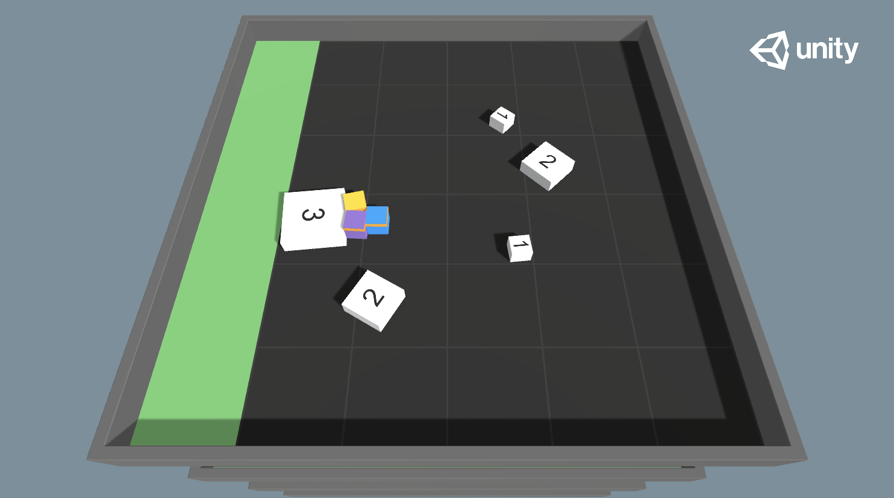
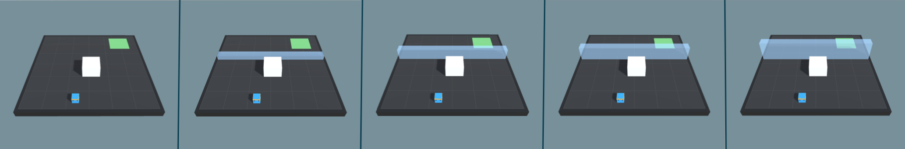
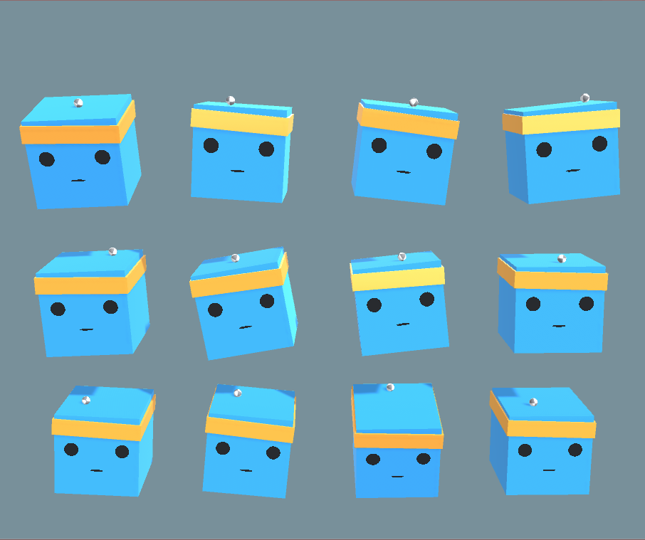
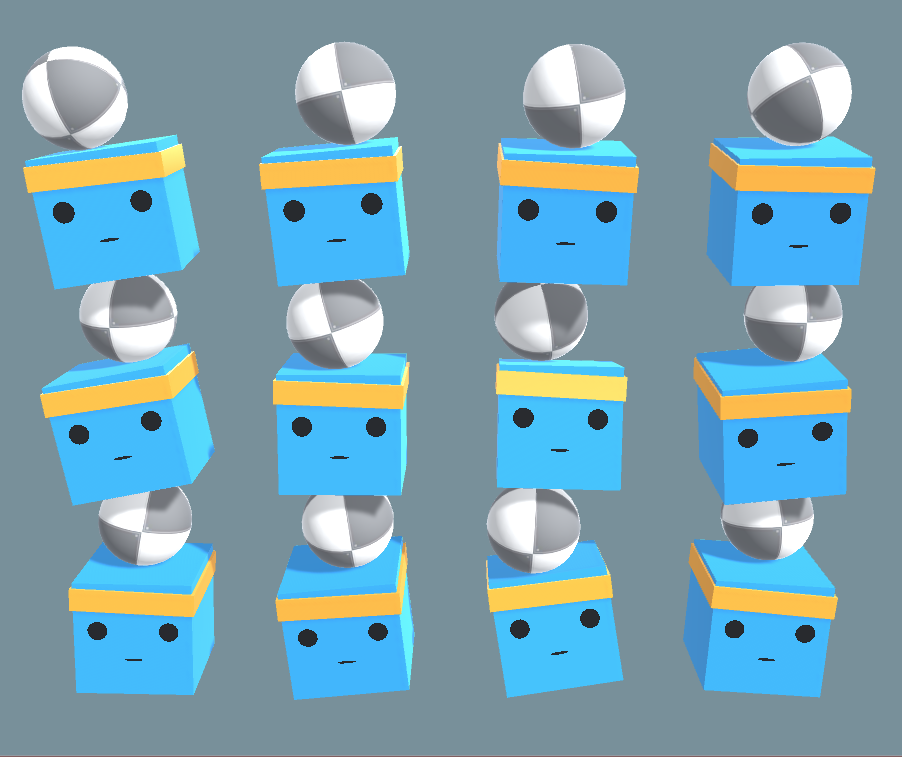
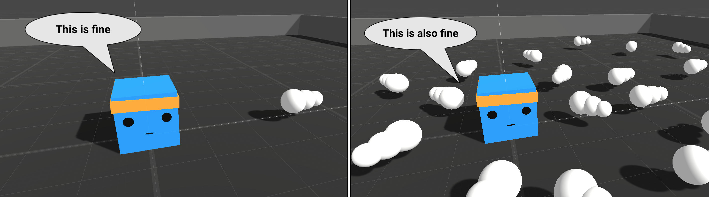
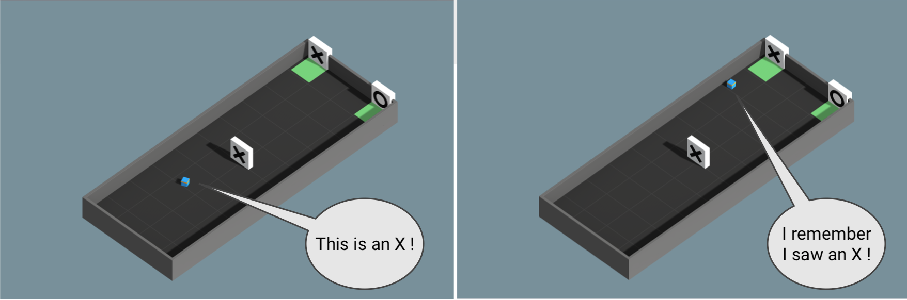

# ML-Agents Toolkit Overview

**Table of Contents**

- [Running Example: Training NPC Behaviors](#running-example-training-npc-behaviors)
- [Key Components](#key-components)
- [Training Modes](#training-modes)
  - [Built-in Training and Inference](#built-in-training-and-inference)
    - [Cross-Platform Inference](#cross-platform-inference)
  - [Custom Training and Inference](#custom-training-and-inference)
- [Flexible Training Scenarios](#flexible-training-scenarios)
- [Training Methods: Environment-agnostic](#training-methods-environment-agnostic)
  - [A Quick Note on Reward Signals](#a-quick-note-on-reward-signals)
  - [Deep Reinforcement Learning](#deep-reinforcement-learning)
    - [Curiosity for Sparse-reward Environments](#curiosity-for-sparse-reward-environments)
    - [RND for Sparse-reward Environments](#rnd-for-sparse-reward-environments)
  - [Imitation Learning](#imitation-learning)
    - [GAIL (Generative Adversarial Imitation Learning)](#gail-generative-adversarial-imitation-learning)
    - [Behavioral Cloning (BC)](#behavioral-cloning-bc)
    - [Recording Demonstrations](#recording-demonstrations)
  - [Summary](#summary)
- [Training Methods: Environment-specific](#training-methods-environment-specific)
  - [Training in Competitive Multi-Agent Environments with Self-Play](#training-in-competitive-multi-agent-environments-with-self-play)
  - [Training in Cooperative Multi-Agent Environments with MA-POCA](#training-in-cooperative-multi-agent-environments-with-ma-poca)
  - [Solving Complex Tasks using Curriculum Learning](#solving-complex-tasks-using-curriculum-learning)
  - [Training Robust Agents using Environment Parameter Randomization](#training-robust-agents-using-environment-parameter-randomization)
- [Model Types](#model-types)
  - [Learning from Vector Observations](#learning-from-vector-observations)
  - [Learning from Cameras using Convolutional Neural Networks](#learning-from-cameras-using-convolutional-neural-networks)
  - [Learning from Variable Length Observations using Attention](#learning-from-variable-length-observations-using-attention)
  - [Memory-enhanced Agents using Recurrent Neural Networks](#memory-enhanced-agents-using-recurrent-neural-networks)
- [Additional Features](#additional-features)
- [Summary and Next Steps](#summary-and-next-steps)

**The Unity Machine Learning Agents Toolkit** (ML-Agents Toolkit)은 지능형 에이전트 훈련 환경으로
게임과 시뮬레이션을 사용할 수 있게 해주는 오픈 소스 프로젝트입니다.
이 툴킷은 간단한 파이썬 API를 통해 `강화학습`, `모방학습`, `신경진화` 또는 기타 `머신러닝` 방법으로 에이전트를 훈련할 수 있도록 합니다.
또한, 2D, 3D, VR/AR 게임에서 지능형 에이전트를 쉽게 훈련할 수 있도록 PyTorch 기반 최신 알고리즘의 구현을 제공합니다.

훈련된 에이전트는 다양한 목적으로 활용될 수 있습니다. 여기서는 NPC 행동제어(다중 에이전트 및 적대적 설정 포함), 게임 빌드의 자동 테스트, 
사전 릴리스 단계에서의 다양한 게임 디자인 결정 평가 등이 포함됩니다.
ML-Agents Toolkit은 유니티의 풍부한 환경에서 AI 연구 성과를 평가하고 이를 연구자 및 게임 개발자 커뮤니티에 제공하는 중심 플랫폼으로서 게임 개발자와 AI 연구자 모두에게 유익한 도구입니다.

사용자 배경(연구자, 게임 개발자, 취미자)에 따라 ML-Agents Toolkit을 처음 접할 때 궁금한 점이 다를 수 있습니다.
툴 킷을 쉽게 활용할 수 있도록 [Unity Engine](Background-Unity.md), [machine learning](Background-Machine-Learning.md), [PyTorch](Background-PyTorch.md)에 대한 개요와 유용한 자료를 제공하는 배경 페이지가 마련되어 있습니다.
유니티 씬에 대한 기본 개념이 없거나 머신러닝 기본 개념에 익숙하지 않은 경우, 또는 PyTorch를 처음 접하는 경우 관련 배경 페이지를 꼭 확인해 보시기 바랍니다.

이 페이지의 나머지 부분에서는 ML-Agents, 주요 구성 요소, 다양한 훈련 모드와 시나리오에 대한 심층적인 설명을 제공합니다.
이 내용을 통해 ML-Agents Toolkit이 무엇을 할 수 있는지에 대한 감을 잡으실 수 있습니다.
이 후의 문서 페이지는 ML-Agents를 어떻게 사용하는지에 대한 예시를 제공합니다.
시작하시려면 [ML-Agents가 작동하는 데모 비디오](https://www.youtube.com/watch?v=fiQsmdwEGT8&feature=youtu.be)를 시청해 보세요.

## Running Example: Training NPC Behaviors(실행 예제: NPC 행동 훈련)

이 페이지에서 다루는 내용과 용어를 설명하기 위해, 예시로 가상의 사례를 사용하겠습니다.
우리는 게임 내 비플레이어 캐릭터(NPC)의 행동을 훈련하는 문제를 탐구할 것입니다.
(NPC는 게임 내에서 인간 플레이어가 제어하지 않으며, 게임 개발자가 미리 정의한 행동을 수행하는 캐릭터입니다.)
구체적으로, 플레이어가 병사를 조종하는 멀티플레이어 전쟁 테마의 게임을 구축한다고 가정해 봅시다.
이 게임에서 우리는 부상당한 플레이어를 찾아 회복시키는 역할을 맡은 NPC '의무병'을 배치합니다.
또한 두 팀이 각각 다섯 명의 플레이어와 한 명의 NPC 의무병으로 구성된다고 가정해 봅시다.

의무병의 행동은 상당히 복잡합니다. 먼저, 의무병은 부상을 피해야 하므로 위험 상황을 감지하고 안전한 위치로 이동하는 능력이 필요합니다.
툴째, 팀원 중 부상당한 사람을 파악하고 도움을 필요로 하는 사람을 인지해야 합니다. 만약 여러명이 부상당했을 경우, 부상의 정도를 평가하고 누구를 먼저 도울지 결정해야 합니다.
마지막으로 훌륭한 의무병은 항상 팀원을 신속히 도울 수 있는 위치에 자리를 잡습니다.
이러한 모든 특성을 고려한다면, 의무병은 매 순간 환경의 여러 속성(예: 팀원의 위치, 적의 위치, 부상당함 팀원의 상태와 정도)을 측정하고 행동(예: 적의 공격을 피하기 위해 숨거나, 팀원 중 한명을 돕기 위해 이동)을 결정해야 합니다.
환경의 다양한 상황과 의무병이 취할 수 있는 수많은 행동을 감안할 때, 이러한 복잡한 행동을 수동으로 정의하고 구현하는 것은 어렵고 오류가 발생하기 쉽습니다.

ML-Agents를 사용하면 이와 같은 NPC(이들을 **에이전트(Agents)** 라고 부릅니다.)의 행동을 다양한 방법으로 훈련 시킬 수 있습니다.
기본적인 개념은 매우 간단합니다. 게임의 매 순간에 세 가지 요소를 정의해야 합니다.(**환경** 이라고 부릅니다.):

- **관찰(Observations)** - 의무병이 환경에서 인지하는 정보입니다. 관찰은 수치형과 시각적 형태로 이루어질 수 있습니다.
  수치형 관찰은 에이전트의 관점에서 환경의 속성을 측정합니다. 의무병의 경우, 전장에서 볼 수 있는 속성들이 이에 해당합니다.
  대부분의 복잡한 환경에서는 에이전트가 여러 연속적인 수치형 관찰이 필요합니다. 반면 시각적 관찰은 에이전트에 부착된 카메라에서 생성된 이미지로,
  에이전트가 특정 시점에 무엇을 보고 있는지를 나타냅니다. 에이전트의 관찰을 환경(또는 게임)의 **상태(state)** 와 혼동하는 경우가 많습니다.
  환경 상태는 모든 게임 캐릭터가 포함된 전체 장면에 대한 정보를 나타냅니다. 반면 에이전트의 관찰은 에이전트가 인지하는 정보만 포함하며, 환경 상태의 일부 집합에 불과합니다.
  예를 들어, 의무병의 관찰에는 의무병이 알지 못하는 숨은 적의 정보가 포함되지 않습니다.
- **Actions** - what actions the medic can take. Similar to observations,
  actions can either be continuous or discrete depending on the complexity of
  the environment and agent. In the case of the medic, if the environment is a
  simple grid world where only their location matters, then a discrete action
  taking on one of four values (north, south, east, west) suffices. However, if
  the environment is more complex and the medic can move freely then using two
  continuous actions (one for direction and another for speed) is more
  appropriate.
- **Reward signals** - a scalar value indicating how well the medic is doing.
  Note that the reward signal need not be provided at every moment, but only
  when the medic performs an action that is good or bad. For example, it can
  receive a large negative reward if it dies, a modest positive reward whenever
  it revives a wounded team member, and a modest negative reward when a wounded
  team member dies due to lack of assistance. Note that the reward signal is how
  the objectives of the task are communicated to the agent, so they need to be
  set up in a manner where maximizing reward generates the desired optimal
  behavior.

After defining these three entities (the building blocks of a **reinforcement
learning task**), we can now _train_ the medic's behavior. This is achieved by
simulating the environment for many trials where the medic, over time, learns
what is the optimal action to take for every observation it measures by
maximizing its future reward. The key is that by learning the actions that
maximize its reward, the medic is learning the behaviors that make it a good
medic (i.e. one who saves the most number of lives). In **reinforcement
learning** terminology, the behavior that is learned is called a **policy**,
which is essentially a (optimal) mapping from observations to actions. Note that
the process of learning a policy through running simulations is called the
**training phase**, while playing the game with an NPC that is using its learned
policy is called the **inference phase**.

The ML-Agents Toolkit provides all the necessary tools for using Unity as the
simulation engine for learning the policies of different objects in a Unity
environment. In the next few sections, we discuss how the ML-Agents Toolkit
achieves this and what features it provides.

## Key Components

The ML-Agents Toolkit contains five high-level components:

- **Learning Environment** - which contains the Unity scene and all the game
  characters. The Unity scene provides the environment in which agents observe,
  act, and learn. How you set up the Unity scene to serve as a learning
  environment really depends on your goal. You may be trying to solve a specific
  reinforcement learning problem of limited scope, in which case you can use the
  same scene for both training and for testing trained agents. Or, you may be
  training agents to operate in a complex game or simulation. In this case, it
  might be more efficient and practical to create a purpose-built training
  scene. The ML-Agents Toolkit includes an ML-Agents Unity SDK
  (`com.unity.ml-agents` package) that enables you to transform any Unity scene
  into a learning environment by defining the agents and their behaviors.
- **Python Low-Level API** - which contains a low-level Python interface for
  interacting and manipulating a learning environment. Note that, unlike the
  Learning Environment, the Python API is not part of Unity, but lives outside
  and communicates with Unity through the Communicator. This API is contained in
  a dedicated `mlagents_envs` Python package and is used by the Python training
  process to communicate with and control the Academy during training. However,
  it can be used for other purposes as well. For example, you could use the API
  to use Unity as the simulation engine for your own machine learning
  algorithms. See [Python API](Python-LLAPI.md) for more information.
- **External Communicator** - which connects the Learning Environment with the
  Python Low-Level API. It lives within the Learning Environment.
- **Python Trainers** which contains all the machine learning algorithms that
  enable training agents. The algorithms are implemented in Python and are part
  of their own `mlagents` Python package. The package exposes a single
  command-line utility `mlagents-learn` that supports all the training methods
  and options outlined in this document. The Python Trainers interface solely
  with the Python Low-Level API.
- **Gym Wrapper** (not pictured). A common way in which machine learning
  researchers interact with simulation environments is via a wrapper provided by
  OpenAI called [gym](https://github.com/openai/gym). We provide a gym wrapper
  in the `ml-agents-envs` package and [instructions](Python-Gym-API.md) for using
  it with existing machine learning algorithms which utilize gym.
- **PettingZoo Wrapper** (not pictured) PettingZoo is python API for
  interacting with multi-agent simulation environments that provides a
  gym-like interface. We provide a PettingZoo wrapper for Unity ML-Agents
  environments in the `ml-agents-envs` package and
  [instructions](Python-PettingZoo-API.md) for using it with machine learning
  algorithms.

  

_Simplified block diagram of ML-Agents._

The Learning Environment contains two Unity Components that help organize the
Unity scene:

- **Agents** - which is attached to a Unity GameObject (any character within a
  scene) and handles generating its observations, performing the actions it
  receives and assigning a reward (positive / negative) when appropriate. Each
  Agent is linked to a Behavior.
- **Behavior** - defines specific attributes of the agent such as the number of
  actions that agent can take. Each Behavior is uniquely identified by a
  `Behavior Name` field. A Behavior can be thought as a function that receives
  observations and rewards from the Agent and returns actions. A Behavior can be
  of one of three types: Learning, Heuristic or Inference. A Learning Behavior
  is one that is not, yet, defined but about to be trained. A Heuristic Behavior
  is one that is defined by a hard-coded set of rules implemented in code. An
  Inference Behavior is one that includes a trained Neural Network file. In
  essence, after a Learning Behavior is trained, it becomes an Inference
  Behavior.

Every Learning Environment will always have one Agent for every character in the
scene. While each Agent must be linked to a Behavior, it is possible for Agents
that have similar observations and actions to have the same Behavior. In our
sample game, we have two teams each with their own medic. Thus we will have two
Agents in our Learning Environment, one for each medic, but both of these medics
can have the same Behavior. This does not mean that at each instance they will
have identical observation and action _values_.

  

_Example block diagram of ML-Agents Toolkit for our sample game._

Note that in a single environment, there can be multiple Agents and multiple
Behaviors at the same time. For example, if we expanded our game to include tank
driver NPCs, then the Agent attached to those characters cannot share its
Behavior with the Agent linked to the medics (medics and drivers have different
actions). The Learning Environment through the Academy (not represented in the
diagram) ensures that all the Agents are in sync in addition to controlling
environment-wide settings.

Lastly, it is possible to exchange data between Unity and Python outside of the
machine learning loop through _Side Channels_. One example of using _Side
Channels_ is to exchange data with Python about _Environment Parameters_. The
following diagram illustrates the above.

  

## Training Modes

Given the flexibility of ML-Agents, there are a few ways in which training and
inference can proceed.

### Built-in Training and Inference

As mentioned previously, the ML-Agents Toolkit ships with several
implementations of state-of-the-art algorithms for training intelligent agents.
More specifically, during training, all the medics in the scene send their
observations to the Python API through the External Communicator. The Python API
processes these observations and sends back actions for each medic to take.
During training these actions are mostly exploratory to help the Python API
learn the best policy for each medic. Once training concludes, the learned
policy for each medic can be exported as a model file. Then during the inference
phase, the medics still continue to generate their observations, but instead of
being sent to the Python API, they will be fed into their (internal, embedded)
model to generate the _optimal_ action for each medic to take at every point in
time.

The [Getting Started Guide](Getting-Started.md) tutorial covers this training
mode with the **3D Balance Ball** sample environment.

#### Cross-Platform Inference

It is important to note that the ML-Agents Toolkit leverages the
[Sentis](Sentis.md) to run the models within a
Unity scene such that an agent can take the _optimal_ action at each step. Given
that Sentis support most platforms that Unity does, this
means that any model you train with the ML-Agents Toolkit can be embedded into
your Unity application that runs on any platform. See our
[dedicated blog post](https://blogs.unity3d.com/2019/03/01/unity-ml-agents-toolkit-v0-7-a-leap-towards-cross-platform-inference/)
for additional information.

### Custom Training and Inference

In the previous mode, the Agents were used for training to generate a PyTorch
model that the Agents can later use. However, any user of the ML-Agents Toolkit
can leverage their own algorithms for training. In this case, the behaviors of
all the Agents in the scene will be controlled within Python. You can even turn
your environment into a [gym.](Python-Gym-API.md)

We do not currently have a tutorial highlighting this mode, but you can learn
more about the Python API [here](Python-LLAPI.md).

## Flexible Training Scenarios

While the discussion so-far has mostly focused on training a single agent, with
ML-Agents, several training scenarios are possible. We are excited to see what
kinds of novel and fun environments the community creates. For those new to
training intelligent agents, below are a few examples that can serve as
inspiration:

- Single-Agent. A single agent, with its own reward signal. The traditional way
  of training an agent. An example is any single-player game, such as Chicken.
- Simultaneous Single-Agent. Multiple independent agents with independent reward
  signals with same `Behavior Parameters`. A parallelized version of the
  traditional training scenario, which can speed-up and stabilize the training
  process. Helpful when you have multiple versions of the same character in an
  environment who should learn similar behaviors. An example might be training a
  dozen robot-arms to each open a door simultaneously.
- Adversarial Self-Play. Two interacting agents with inverse reward signals. In
  two-player games, adversarial self-play can allow an agent to become
  increasingly more skilled, while always having the perfectly matched opponent:
  itself. This was the strategy employed when training AlphaGo, and more
  recently used by OpenAI to train a human-beating 1-vs-1 Dota 2 agent.
- Cooperative Multi-Agent. Multiple interacting agents with a shared reward
  signal with same or different `Behavior Parameters`. In this scenario, all
  agents must work together to accomplish a task that cannot be done alone.
  Examples include environments where each agent only has access to partial
  information, which needs to be shared in order to accomplish the task or
  collaboratively solve a puzzle.
- Competitive Multi-Agent. Multiple interacting agents with inverse reward
  signals with same or different `Behavior Parameters`. In this scenario, agents
  must compete with one another to either win a competition, or obtain some
  limited set of resources. All team sports fall into this scenario.
- Ecosystem. Multiple interacting agents with independent reward signals with
  same or different `Behavior Parameters`. This scenario can be thought of as
  creating a small world in which animals with different goals all interact,
  such as a savanna in which there might be zebras, elephants and giraffes, or
  an autonomous driving simulation within an urban environment.

## Training Methods: Environment-agnostic

The remaining sections overview the various state-of-the-art machine learning
algorithms that are part of the ML-Agents Toolkit. If you aren't studying
machine and reinforcement learning as a subject and just want to train agents to
accomplish tasks, you can treat these algorithms as _black boxes_. There are a
few training-related parameters to adjust inside Unity as well as on the Python
training side, but you do not need in-depth knowledge of the algorithms
themselves to successfully create and train agents. Step-by-step procedures for
running the training process are provided in the
[Training ML-Agents](Training-ML-Agents.md) page.

This section specifically focuses on the training methods that are available
regardless of the specifics of your learning environment.

#### A Quick Note on Reward Signals

In this section we introduce the concepts of _intrinsic_ and _extrinsic_
rewards, which helps explain some of the training methods.

In reinforcement learning, the end goal for the Agent is to discover a behavior
(a Policy) that maximizes a reward. You will need to provide the agent one or
more reward signals to use during training. Typically, a reward is defined by
your environment, and corresponds to reaching some goal. These are what we refer
to as _extrinsic_ rewards, as they are defined external of the learning
algorithm.

Rewards, however, can be defined outside of the environment as well, to
encourage the agent to behave in certain ways, or to aid the learning of the
true extrinsic reward. We refer to these rewards as _intrinsic_ reward signals.
The total reward that the agent will learn to maximize can be a mix of extrinsic
and intrinsic reward signals.

The ML-Agents Toolkit allows reward signals to be defined in a modular way, and
we provide four reward signals that can the mixed and matched to help shape
your agent's behavior:

- `extrinsic`: represents the rewards defined in your environment, and is
  enabled by default
- `gail`: represents an intrinsic reward signal that is defined by GAIL (see
  below)
- `curiosity`: represents an intrinsic reward signal that encourages exploration
  in sparse-reward environments that is defined by the Curiosity module (see
  below).
- `rnd`: represents an intrinsic reward signal that encourages exploration
  in sparse-reward environments that is defined by the Curiosity module (see
  below).

### Deep Reinforcement Learning

ML-Agents provide an implementation of two reinforcement learning algorithms:

- [Proximal Policy Optimization (PPO)](https://openai.com/research/openai-baselines-ppo)
- [Soft Actor-Critic (SAC)](https://bair.berkeley.edu/blog/2018/12/14/sac/)

The default algorithm is PPO. This is a method that has been shown to be more
general purpose and stable than many other RL algorithms.

In contrast with PPO, SAC is _off-policy_, which means it can learn from
experiences collected at any time during the past. As experiences are collected,
they are placed in an experience replay buffer and randomly drawn during
training. This makes SAC significantly more sample-efficient, often requiring
5-10 times less samples to learn the same task as PPO. However, SAC tends to
require more model updates. SAC is a good choice for heavier or slower
environments (about 0.1 seconds per step or more). SAC is also a "maximum
entropy" algorithm, and enables exploration in an intrinsic way. Read more about
maximum entropy RL
[here](https://bair.berkeley.edu/blog/2017/10/06/soft-q-learning/).

#### Curiosity for Sparse-reward Environments

In environments where the agent receives rare or infrequent rewards (i.e.
sparse-reward), an agent may never receive a reward signal on which to bootstrap
its training process. This is a scenario where the use of an intrinsic reward
signals can be valuable. Curiosity is one such signal which can help the agent
explore when extrinsic rewards are sparse.

The `curiosity` Reward Signal enables the Intrinsic Curiosity Module. This is an
implementation of the approach described in
[Curiosity-driven Exploration by Self-supervised Prediction](https://pathak22.github.io/noreward-rl/)
by Pathak, et al. It trains two networks:

- an inverse model, which takes the current and next observation of the agent,
  encodes them, and uses the encoding to predict the action that was taken
  between the observations
- a forward model, which takes the encoded current observation and action, and
  predicts the next encoded observation.

The loss of the forward model (the difference between the predicted and actual
encoded observations) is used as the intrinsic reward, so the more surprised the
model is, the larger the reward will be.

For more information, see our dedicated
[blog post on the Curiosity module](https://blogs.unity3d.com/2018/06/26/solving-sparse-reward-tasks-with-curiosity/).

#### RND for Sparse-reward Environments

Similarly to Curiosity, Random Network Distillation (RND) is useful in sparse or rare
reward environments as it helps the Agent explore. The RND Module is implemented following
the paper [Exploration by Random Network Distillation](https://arxiv.org/abs/1810.12894).
RND uses two networks:

 - The first is a network with fixed random weights that takes observations as inputs and
 generates an encoding
 - The second is a network with similar architecture that is trained to predict the
 outputs of the first network and uses the observations the Agent collects as training data.

The loss (the squared difference between the predicted and actual encoded observations)
of the trained model is used as intrinsic reward. The more an Agent visits a state, the
more accurate the predictions and the lower the rewards which encourages the Agent to
explore new states with higher prediction errors.

### Imitation Learning

It is often more intuitive to simply demonstrate the behavior we want an agent
to perform, rather than attempting to have it learn via trial-and-error methods.
For example, instead of indirectly training a medic with the help of a reward
function, we can give the medic real world examples of observations from the
game and actions from a game controller to guide the medic's behavior. Imitation
Learning uses pairs of observations and actions from a demonstration to learn a
policy. See this [video demo](https://youtu.be/kpb8ZkMBFYs) of imitation
learning .

Imitation learning can either be used alone or in conjunction with reinforcement
learning. If used alone it can provide a mechanism for learning a specific type
of behavior (i.e. a specific style of solving the task). If used in conjunction
with reinforcement learning it can dramatically reduce the time the agent takes
to solve the environment. This can be especially pronounced in sparse-reward
environments. For instance, on the
[Pyramids environment](Learning-Environment-Examples.md#pyramids), using 6
episodes of demonstrations can reduce training steps by more than 4 times. See
Behavioral Cloning + GAIL + Curiosity + RL below.

  

The ML-Agents Toolkit provides a way to learn directly from demonstrations, as
well as use them to help speed up reward-based training (RL). We include two
algorithms called Behavioral Cloning (BC) and Generative Adversarial Imitation
Learning (GAIL). In most scenarios, you can combine these two features:

- If you want to help your agents learn (especially with environments that have
  sparse rewards) using pre-recorded demonstrations, you can generally enable
  both GAIL and Behavioral Cloning at low strengths in addition to having an
  extrinsic reward. An example of this is provided for the PushBlock example
  environment in `config/imitation/PushBlock.yaml`.
- If you want to train purely from demonstrations with GAIL and BC _without_ an
  extrinsic reward signal, please see the CrawlerStatic example environment under
  in `config/imitation/CrawlerStatic.yaml`.

***Note:*** GAIL introduces a [_survivor bias_](https://arxiv.org/pdf/1809.02925.pdf)
to the learning process. That is, by giving positive rewards based on similarity
to the expert, the agent is incentivized to remain alive for as long as possible.
This can directly conflict with goal-oriented tasks like our PushBlock or Pyramids
example environments where an agent must reach a goal state thus ending the
episode as quickly as possible. In these cases, we strongly recommend that you
use a low strength GAIL reward signal and a sparse extrinsic signal when
the agent achieves the task. This way, the GAIL reward signal will guide the
agent until it discovers the extrinsic signal and will not overpower it. If the
agent appears to be ignoring the extrinsic reward signal, you should reduce
the strength of GAIL.

#### GAIL (Generative Adversarial Imitation Learning)

GAIL, or
[Generative Adversarial Imitation Learning](https://arxiv.org/abs/1606.03476),
uses an adversarial approach to reward your Agent for behaving similar to a set
of demonstrations. GAIL can be used with or without environment rewards, and
works well when there are a limited number of demonstrations. In this framework,
a second neural network, the discriminator, is taught to distinguish whether an
observation/action is from a demonstration or produced by the agent. This
discriminator can then examine a new observation/action and provide it a reward
based on how close it believes this new observation/action is to the provided
demonstrations.

At each training step, the agent tries to learn how to maximize this reward.
Then, the discriminator is trained to better distinguish between demonstrations
and agent state/actions. In this way, while the agent gets better and better at
mimicking the demonstrations, the discriminator keeps getting stricter and
stricter and the agent must try harder to "fool" it.

This approach learns a _policy_ that produces states and actions similar to the
demonstrations, requiring fewer demonstrations than direct cloning of the
actions. In addition to learning purely from demonstrations, the GAIL reward
signal can be mixed with an extrinsic reward signal to guide the learning
process.

#### Behavioral Cloning (BC)

BC trains the Agent's policy to exactly mimic the actions shown in a set of
demonstrations. The BC feature can be enabled on the PPO or SAC trainers. As BC
cannot generalize past the examples shown in the demonstrations, BC tends to
work best when there exists demonstrations for nearly all of the states that the
agent can experience, or in conjunction with GAIL and/or an extrinsic reward.

#### Recording Demonstrations

Demonstrations of agent behavior can be recorded from the Unity Editor or build,
and saved as assets. These demonstrations contain information on the
observations, actions, and rewards for a given agent during the recording
session. They can be managed in the Editor, as well as used for training with BC
and GAIL. See the
[Designing Agents](Learning-Environment-Design-Agents.md#recording-demonstrations)
page for more information on how to record demonstrations for your agent.

### Summary

To summarize, we provide 3 training methods: BC, GAIL and RL (PPO or SAC) that
can be used independently or together:

- BC can be used on its own or as a pre-training step before GAIL and/or RL
- GAIL can be used with or without extrinsic rewards
- RL can be used on its own (either PPO or SAC) or in conjunction with BC and/or
  GAIL.

Leveraging either BC or GAIL requires recording demonstrations to be provided as
input to the training algorithms.

## Training Methods: Environment-specific

In addition to the three environment-agnostic training methods introduced in the
previous section, the ML-Agents Toolkit provides additional methods that can aid
in training behaviors for specific types of environments.

### Training in Competitive Multi-Agent Environments with Self-Play

ML-Agents provides the functionality to train both symmetric and asymmetric
adversarial games with
[Self-Play](https://openai.com/research/competitive-self-play). A symmetric game is
one in which opposing agents are equal in form, function and objective. Examples
of symmetric games are our Tennis and Soccer example environments. In
reinforcement learning, this means both agents have the same observation and
actions and learn from the same reward function and so _they can share the
same policy_. In asymmetric games, this is not the case. An example of an
asymmetric games are Hide and Seek. Agents in these types of games do not always
have the same observation or actions and so sharing policy networks is not
necessarily ideal.

With self-play, an agent learns in adversarial games by competing against fixed,
past versions of its opponent (which could be itself as in symmetric games) to
provide a more stable, stationary learning environment. This is compared to
competing against the current, best opponent in every episode, which is
constantly changing (because it's learning).

Self-play can be used with our implementations of both Proximal Policy
Optimization (PPO) and Soft Actor-Critic (SAC). However, from the perspective of
an individual agent, these scenarios appear to have non-stationary dynamics
because the opponent is often changing. This can cause significant issues in the
experience replay mechanism used by SAC. Thus, we recommend that users use PPO.
For further reading on this issue in particular, see the paper
[Stabilising Experience Replay for Deep Multi-Agent Reinforcement Learning](https://arxiv.org/pdf/1702.08887.pdf).

See our
[Designing Agents](Learning-Environment-Design-Agents.md#defining-teams-for-multi-agent-scenarios)
page for more information on setting up teams in your Unity scene. Also, read
our
[blog post on self-play](https://blogs.unity3d.com/2020/02/28/training-intelligent-adversaries-using-self-play-with-ml-agents/)
for additional information. Additionally, check [ELO Rating System](ELO-Rating-System.md) the method we use to calculate
the relative skill level between two players.

### Training In Cooperative Multi-Agent Environments with MA-POCA

ML-Agents provides the functionality for training cooperative behaviors - i.e.,
groups of agents working towards a common goal, where the success of the individual
is linked to the success of the whole group. In such a scenario, agents typically receive
rewards as a group. For instance, if a team of agents wins a game against an opposing
team, everyone is rewarded - even agents who did not directly contribute to the win. This
makes learning what to do as an individual difficult - you may get a win
for doing nothing, and a loss for doing your best.

In ML-Agents, we provide MA-POCA (MultiAgent POsthumous Credit Assignment), which
is a novel multi-agent trainer that trains a _centralized critic_, a neural network
that acts as a "coach" for a whole group of agents. You can then give rewards to the team
as a whole, and the agents will learn how best to contribute to achieving that reward.
Agents can _also_ be given rewards individually, and the team will work together to help the
individual achieve those goals. During an episode, agents can be added or removed from the group,
such as when agents spawn or die in a game. If agents are removed mid-episode (e.g., if teammates die
or are removed from the game), they will still learn whether their actions contributed
to the team winning later, enabling agents to take group-beneficial actions even if
they result in the individual being removed from the game (i.e., self-sacrifice).
MA-POCA can also be combined with self-play to train teams of agents to play against each other.

To learn more about enabling cooperative behaviors for agents in an ML-Agents environment,
check out [this page](Learning-Environment-Design-Agents.md#groups-for-cooperative-scenarios).

To learn more about MA-POCA, please see our paper
[On the Use and Misuse of Absorbing States in Multi-Agent Reinforcement Learning](https://arxiv.org/pdf/2111.05992.pdf).
For further reading, MA-POCA builds on previous work in multi-agent cooperative learning
([Lowe et al.](https://arxiv.org/abs/1706.02275), [Foerster et al.](https://arxiv.org/pdf/1705.08926.pdf),
among others) to enable the above use-cases.

### Solving Complex Tasks using Curriculum Learning

Curriculum learning is a way of training a machine learning model where more
difficult aspects of a problem are gradually introduced in such a way that the
model is always optimally challenged. This idea has been around for a long time,
and it is how we humans typically learn. If you imagine any childhood primary
school education, there is an ordering of classes and topics. Arithmetic is
taught before algebra, for example. Likewise, algebra is taught before calculus.
The skills and knowledge learned in the earlier subjects provide a scaffolding
for later lessons. The same principle can be applied to machine learning, where
training on easier tasks can provide a scaffolding for harder tasks in the
future.

Imagine training the medic to scale a wall to arrive at a wounded team
member. The starting point when training a medic to accomplish this task will be
a random policy. That starting policy will have the medic running in circles,
and will likely never, or very rarely scale the wall properly to revive their
team member (and achieve the reward). If we start with a simpler task, such as
moving toward an unobstructed team member, then the medic can easily learn to
accomplish the task. From there, we can slowly add to the difficulty of the task
by increasing the size of the wall until the medic can complete the initially
near-impossible task of scaling the wall. We have included an environment to
demonstrate this with ML-Agents, called
[Wall Jump](Learning-Environment-Examples.md#wall-jump).

_Demonstration of a hypothetical curriculum training scenario in which a
progressively taller wall obstructs the path to the goal._

_[**Note**: The example provided above is for instructional purposes, and was
based on an early version of the
[Wall Jump example environment](Learning-Environment-Examples.md). As such, it
is not possible to directly replicate the results here using that environment.]_

The ML-Agents Toolkit supports modifying custom environment parameters during
the training process to aid in learning. This allows elements of the environment
related to difficulty or complexity to be dynamically adjusted based on training
progress. The [Training ML-Agents](Training-ML-Agents.md#curriculum-learning)
page has more information on defining training curriculums.

### Training Robust Agents using Environment Parameter Randomization

An agent trained on a specific environment, may be unable to generalize to any
tweaks or variations in the environment (in machine learning this is referred to
as overfitting). This becomes problematic in cases where environments are
instantiated with varying objects or properties. One mechanism to alleviate this
and train more robust agents that can generalize to unseen variations of the
environment is to expose them to these variations during training. Similar to
Curriculum Learning, where environments become more difficult as the agent
learns, the ML-Agents Toolkit provides a way to randomly sample parameters of
the environment during training. We refer to this approach as **Environment
Parameter Randomization**. For those familiar with Reinforcement Learning
research, this approach is based on the concept of
[Domain Randomization](https://arxiv.org/abs/1703.06907). By using
[parameter randomization during training](Training-ML-Agents.md#environment-parameter-randomization),
the agent can be better suited to adapt (with higher performance) to future
unseen variations of the environment.

|      Ball scale of 0.5       |      Ball scale of 4       |
| :--------------------------: | :------------------------: |
|  |  |

_Example of variations of the 3D Ball environment. The environment parameters
are `gravity`, `ball_mass` and `ball_scale`._

## Model Types

Regardless of the training method deployed, there are a few model types that
users can train using the ML-Agents Toolkit. This is due to the flexibility in
defining agent observations, which include vector, ray cast and visual
observations. You can learn more about how to instrument an agent's observation
in the [Designing Agents](Learning-Environment-Design-Agents.md) guide.

### Learning from Vector Observations

Whether an agent's observations are ray cast or vector, the ML-Agents Toolkit
provides a fully connected neural network model to learn from those
observations. At training time you can configure different aspects of this model
such as the number of hidden units and number of layers.

### Learning from Cameras using Convolutional Neural Networks

Unlike other platforms, where the agent’s observation might be limited to a
single vector or image, the ML-Agents Toolkit allows multiple cameras to be used
for observations per agent. This enables agents to learn to integrate
information from multiple visual streams. This can be helpful in several
scenarios such as training a self-driving car which requires multiple cameras
with different viewpoints, or a navigational agent which might need to integrate
aerial and first-person visuals. You can learn more about adding visual
observations to an agent
[here](Learning-Environment-Design-Agents.md#multiple-visual-observations).

When visual observations are utilized, the ML-Agents Toolkit leverages
convolutional neural networks (CNN) to learn from the input images. We offer
three network architectures:

- a simple encoder which consists of two convolutional layers
- the implementation proposed by
  [Mnih et al.](https://www.nature.com/articles/nature14236), consisting of
  three convolutional layers,
- the [IMPALA Resnet](https://arxiv.org/abs/1802.01561) consisting of three
  stacked layers, each with two residual blocks, making a much larger network
  than the other two.

The choice of the architecture depends on the visual complexity of the scene and
the available computational resources.

### Learning from Variable Length Observations using Attention

Using the ML-Agents Toolkit, it is possible to have agents learn from a
varying number of inputs. To do so, each agent can keep track of a buffer
of vector observations. At each step, the agent will go through all the
elements in the buffer and extract information but the elements
in the buffer can change at every step.
This can be useful in scenarios in which the agents must keep track of
a varying number of elements throughout the episode. For example in a game
where an agent must learn to avoid projectiles, but the projectiles can vary in
numbers.

You can learn more about variable length observations
[here](Learning-Environment-Design-Agents.md#variable-length-observations).
When variable length observations are utilized, the ML-Agents Toolkit
leverages attention networks to learn from a varying number of entities.
Agents using attention will ignore entities that are deemed not relevant
and pay special attention to entities relevant to the current situation
based on context.

### Memory-enhanced Agents using Recurrent Neural Networks

Have you ever entered a room to get something and immediately forgot what you
were looking for? Don't let that happen to your agents.

In some scenarios, agents must learn to remember the past in order to take the
best decision. When an agent only has partial observability of the environment,
keeping track of past observations can help the agent learn. Deciding what the
agents should remember in order to solve a task is not easy to do by hand, but
our training algorithms can learn to keep track of what is important to remember
with [LSTM](https://en.wikipedia.org/wiki/Long_short-term_memory).

## Additional Features

Beyond the flexible training scenarios available, the ML-Agents Toolkit includes
additional features which improve the flexibility and interpretability of the
training process.

- **Concurrent Unity Instances** - We enable developers to run concurrent,
  parallel instances of the Unity executable during training. For certain
  scenarios, this should speed up training. Check out our dedicated page on
  [creating a Unity executable](Learning-Environment-Executable.md) and the
  [Training ML-Agents](Training-ML-Agents.md#training-using-concurrent-unity-instances)
  page for instructions on how to set the number of concurrent instances.
- **Recording Statistics from Unity** - We enable developers to
  [record statistics](Learning-Environment-Design.md#recording-statistics) from
  within their Unity environments. These statistics are aggregated and generated
  during the training process.
- **Custom Side Channels** - We enable developers to
  [create custom side channels](Custom-SideChannels.md) to manage data transfer
  between Unity and Python that is unique to their training workflow and/or
  environment.
- **Custom Samplers** - We enable developers to
  [create custom sampling methods](Training-ML-Agents.md#defining-a-new-sampler-type)
  for Environment Parameter Randomization. This enables users to customize this
  training method for their particular environment.

## Summary and Next Steps

To briefly summarize: The ML-Agents Toolkit enables games and simulations built
in Unity to serve as the platform for training intelligent agents. It is
designed to enable a large variety of training modes and scenarios and comes
packed with several features to enable researchers and developers to leverage
(and enhance) machine learning within Unity.

In terms of next steps:

- For a walkthrough of running ML-Agents with a simple scene, check out the
  [Getting Started](Getting-Started.md) guide.
- For a "Hello World" introduction to creating your own Learning Environment,
  check out the
  [Making a New Learning Environment](Learning-Environment-Create-New.md) page.
- For an overview on the more complex example environments that are provided in
  this toolkit, check out the
  [Example Environments](Learning-Environment-Examples.md) page.
- For more information on the various training options available, check out the
  [Training ML-Agents](Training-ML-Agents.md) page.
