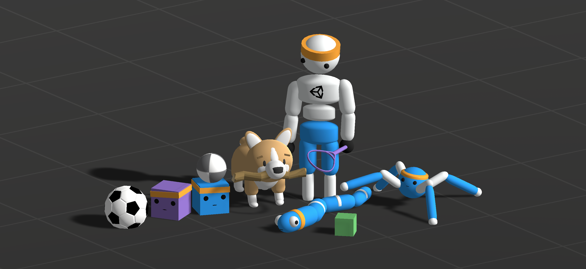

# Unity ML-Agents Toolkit

[](https://github.com/Unity-Technologies/ml-agents/tree/release_22_docs/docs/)

[](../LICENSE.md)

([latest release](https://github.com/Unity-Technologies/ml-agents/releases/tag/latest_release))
([all releases](https://github.com/Unity-Technologies/ml-agents/releases))

**The Unity Machine Learning Agents Toolkit** (ML-Agents) 은 게임과 시뮬레이션이 지능형 에이전트를 훈련하는 환경으로 활용될 수 있도록 하는 오픈 소스 프로젝트입니다. 우리는 게임 개발자와 취미로 개발하는 이들이 2D, 3D 및 VR/AR 게임을 위해 지능형 에이전트를 쉽게 훈련할 수 있도록 최신 알고리즘을 PyTorch 기반으로 구현하여 제공합니다. 연구자들은 제공된 간단한 Python API를 사용하여 강화 학습, 모방 학습, 신경 진화 또는 기타 방법을 통해 에이전트를 훈련할 수 있습니다. 훈련된 에이전트는 NPC 행동 제어(다양한 설정에서의 다중 에이전트 및 경쟁 환경 포함), 게임 빌드의 자동 테스트, 출시 전 다양한 게임 디자인 결정 평가 등 여러 용도로 사용될 수 있습니다. ML-Agents 툴킷은 게임 개발자와 AI 연구자 모두에게 상호 이익이 되며, AI의 발전을 Unity의 다양한 환경에서 평가하고 이를 더 넓은 연구 및 게임 개발 커뮤니티에 제공할 수 있는 중앙 플랫폼을 제공합니다.


## Features(기능)
- 17개 이상의 [예제 Unity 환경](Learning-Environment-Examples.md)
- 다양한 환경 구성 및 훈련 시나리오 지원
- 게임이나 커스텀(제작한) Unity 장면에 통합할 수 있는 유연한 Unity SDK
- 여러 심층 강화 학습 알고리즘(PPO, SAC, MA-POCA, self-play(자가 대결))을 통해
  단일 에이전트, 다중 에이전트 협력, 다중 에이전트 경쟁 시나리오 훈련지원.
- 두 가지 모방 학습 알고리즘(BC 및 GAIL)을 통한 시연 학습 지원.
- 자신의 [custom training algorithm(제작한 훈련 알고리즘)](Python-Custom-Trainer-Plugin.md) 및/또는 구성 요소를 빠르고 쉽게 추가 가능.
- 복잡한 작업을 위한 커리큘럼 학습 시나리오를 쉽게 정의 가능
- 환경 랜덤화를 사용하여 견고한 에이전트 훈련
- 필요에 따라 의사 결정을 할 수 있는 유연한 에이전트 제어
- 다중 Unity 환경 인스턴스를 사용하여 훈련 가능
- [Sentis](Sentis.md)를 활용하여 네이티브 크로스 플랫폼 지원 제공
- Python에서 Unity 환경 제어 [control from Python](Python-LLAPI.md)
- Unity 학습 환경을 [gym](Python-Gym-API.md) 환경으로 래핑
- Unity 학습 환경을 [PettingZoo](Python-PettingZoo-API.md) 환경으로 래핑

모든 기능에 대한 자세한 설명은 우리의 [ML-Agents Overview](ML-Agents-Overview.md) 페이지를 참조하세요.
또는 바로 웹 문서[web docs](https://unity-technologies.github.io/ml-agents/)로 이동하실 수 있습니다.

## Releases & Documentation(릴리스 및 문서)

**최신 안정 릴리스는 `Release 22` 입니다. 여기를 클릭[here](Getting-Started.md)하여 ML-Agents의 최신 릴리스를 시작하세요.**

**You can also check out our new [web docs](https://unity-technologies.github.io/ml-agents/)!**

The table below lists all our releases, including our `main` branch which is
under active development and may be unstable. A few helpful guidelines:

- The [Versioning page](Versioning.md) overviews how we manage our GitHub
  releases and the versioning process for each of the ML-Agents components.
- The [Releases page](https://github.com/Unity-Technologies/ml-agents/releases)
  contains details of the changes between releases.
- The [Migration page](Migrating.md) contains details on how to upgrade
  from earlier releases of the ML-Agents Toolkit.
- The **Documentation** links in the table below include installation and usage
  instructions specific to each release. Remember to always use the
  documentation that corresponds to the release version you're using.
- The `com.unity.ml-agents` package is [verified](https://docs.unity3d.com/2020.1/Documentation/Manual/pack-safe.html)
  for Unity 2020.1 and later. Verified packages releases are numbered 1.0.x.

|        **Version**         | **Release Date** | **Source** | **Documentation** | **Download** | **Python Package** | **Unity Package** |
|:--------------------------:|:------:|:-------------:|:-------:|:------------:|:------------:|:------------:|
| **Release 22** | **October 5, 2024** | **[source](https://github.com/Unity-Technologies/ml-agents/tree/release_22)** | **[docs](https://unity-technologies.github.io/ml-agents/)** | **[Installation](https://github.com/KangDongYoon8111/ml-agents-KR/blob/main/docs/Installation.md)** | **[1.1.0](https://pypi.org/project/mlagents/1.1.0/)** | **[3.0.0](https://docs.unity3d.com/Packages/com.unity.ml-agents@3.0/manual/index.html)** |
| **develop (unstable)** | -- | [source](https://github.com/Unity-Technologies/ml-agents/tree/develop) | [docs](https://unity-technologies.github.io/ml-agents/) | [download](https://github.com/Unity-Technologies/ml-agents/archive/develop.zip) | -- | -- |


If you are a researcher interested in a discussion of Unity as an AI platform,
see a pre-print of our
[reference paper on Unity and the ML-Agents Toolkit](https://arxiv.org/abs/1809.02627).

If you use Unity or the ML-Agents Toolkit to conduct research, we ask that you
cite the following paper as a reference:

```
@article{juliani2020,
  title={Unity: A general platform for intelligent agents},
  author={Juliani, Arthur and Berges, Vincent-Pierre and Teng, Ervin and Cohen, Andrew and Harper, Jonathan and Elion, Chris and Goy, Chris and Gao, Yuan and Henry, Hunter and Mattar, Marwan and Lange, Danny},
  journal={arXiv preprint arXiv:1809.02627},
  url={https://arxiv.org/pdf/1809.02627.pdf},
  year={2020}
}
```

Additionally, if you use the MA-POCA trainer in your research, we ask that you
cite the following paper as a reference:

```
@article{cohen2022,
  title={On the Use and Misuse of Absorbing States in Multi-agent Reinforcement Learning},
  author={Cohen, Andrew and Teng, Ervin and Berges, Vincent-Pierre and Dong, Ruo-Ping and Henry, Hunter and Mattar, Marwan and Zook, Alexander and Ganguly, Sujoy},
  journal={RL in Games Workshop AAAI 2022},
  url={http://aaai-rlg.mlanctot.info/papers/AAAI22-RLG_paper_32.pdf},
  year={2022}
}
```


## Additional Resources

We have a Unity Learn course,
[ML-Agents: Hummingbirds](https://learn.unity.com/course/ml-agents-hummingbirds),
that provides a gentle introduction to Unity and the ML-Agents Toolkit.

We've also partnered with
[CodeMonkeyUnity](https://www.youtube.com/c/CodeMonkeyUnity) to create a
[series of tutorial videos](https://www.youtube.com/playlist?list=PLzDRvYVwl53vehwiN_odYJkPBzcqFw110)
on how to implement and use the ML-Agents Toolkit.

We have also published a series of blog posts that are relevant for ML-Agents:

- (July 12, 2021)
  [ML-Agents plays Dodgeball](https://blog.unity.com/technology/ml-agents-plays-dodgeball)
- (May 5, 2021)
  [ML-Agents v2.0 release: Now supports training complex cooperative behaviors](https://blogs.unity3d.com/2021/05/05/ml-agents-v2-0-release-now-supports-training-complex-cooperative-behaviors/)
- (December 28, 2020)
  [Happy holidays from the Unity ML-Agents team!](https://blogs.unity3d.com/2020/12/28/happy-holidays-from-the-unity-ml-agents-team/)
- (November 20, 2020)
  [How Eidos-Montréal created Grid Sensors to improve observations for training agents](https://blogs.unity3d.com/2020/11/20/how-eidos-montreal-created-grid-sensors-to-improve-observations-for-training-agents/)
- (November 11, 2020)
  [2020 AI@Unity interns shoutout](https://blogs.unity3d.com/2020/11/11/2020-aiunity-interns-shoutout/)
- (May 12, 2020)
  [Announcing ML-Agents Unity Package v1.0!](https://blogs.unity3d.com/2020/05/12/announcing-ml-agents-unity-package-v1-0/)
- (February 28, 2020)
  [Training intelligent adversaries using self-play with ML-Agents](https://blogs.unity3d.com/2020/02/28/training-intelligent-adversaries-using-self-play-with-ml-agents/)
- (November 11, 2019)
  [Training your agents 7 times faster with ML-Agents](https://blogs.unity3d.com/2019/11/11/training-your-agents-7-times-faster-with-ml-agents/)
- (October 21, 2019)
  [The AI@Unity interns help shape the world](https://blogs.unity3d.com/2019/10/21/the-aiunity-interns-help-shape-the-world/)
- (April 15, 2019)
  [Unity ML-Agents Toolkit v0.8: Faster training on real games](https://blogs.unity3d.com/2019/04/15/unity-ml-agents-toolkit-v0-8-faster-training-on-real-games/)
- (March 1, 2019)
  [Unity ML-Agents Toolkit v0.7: A leap towards cross-platform inference](https://blogs.unity3d.com/2019/03/01/unity-ml-agents-toolkit-v0-7-a-leap-towards-cross-platform-inference/)
- (December 17, 2018)
  [ML-Agents Toolkit v0.6: Improved usability of Brains and Imitation Learning](https://blogs.unity3d.com/2018/12/17/ml-agents-toolkit-v0-6-improved-usability-of-brains-and-imitation-learning/)
- (October 2, 2018)
  [Puppo, The Corgi: Cuteness Overload with the Unity ML-Agents Toolkit](https://blogs.unity3d.com/2018/10/02/puppo-the-corgi-cuteness-overload-with-the-unity-ml-agents-toolkit/)
- (September 11, 2018)
  [ML-Agents Toolkit v0.5, new resources for AI researchers available now](https://blogs.unity3d.com/2018/09/11/ml-agents-toolkit-v0-5-new-resources-for-ai-researchers-available-now/)
- (June 26, 2018)
  [Solving sparse-reward tasks with Curiosity](https://blogs.unity3d.com/2018/06/26/solving-sparse-reward-tasks-with-curiosity/)
- (June 19, 2018)
  [Unity ML-Agents Toolkit v0.4 and Udacity Deep Reinforcement Learning Nanodegree](https://blogs.unity3d.com/2018/06/19/unity-ml-agents-toolkit-v0-4-and-udacity-deep-reinforcement-learning-nanodegree/)
- (May 24, 2018)
  [Imitation Learning in Unity: The Workflow](https://blogs.unity3d.com/2018/05/24/imitation-learning-in-unity-the-workflow/)
- (March 15, 2018)
  [ML-Agents Toolkit v0.3 Beta released: Imitation Learning, feedback-driven features, and more](https://blogs.unity3d.com/2018/03/15/ml-agents-v0-3-beta-released-imitation-learning-feedback-driven-features-and-more/)
- (December 11, 2017)
  [Using Machine Learning Agents in a real game: a beginner’s guide](https://blogs.unity3d.com/2017/12/11/using-machine-learning-agents-in-a-real-game-a-beginners-guide/)
- (December 8, 2017)
  [Introducing ML-Agents Toolkit v0.2: Curriculum Learning, new environments, and more](https://blogs.unity3d.com/2017/12/08/introducing-ml-agents-v0-2-curriculum-learning-new-environments-and-more/)
- (September 19, 2017)
  [Introducing: Unity Machine Learning Agents Toolkit](https://blogs.unity3d.com/2017/09/19/introducing-unity-machine-learning-agents/)
- Overviewing reinforcement learning concepts
  ([multi-armed bandit](https://blogs.unity3d.com/2017/06/26/unity-ai-themed-blog-entries/)
  and
  [Q-learning](https://blogs.unity3d.com/2017/08/22/unity-ai-reinforcement-learning-with-q-learning/))

### More from Unity

- [Unity Sentis](https://unity.com/products/sentis)
- [Introducing Unity Muse and Sentis](https://blog.unity.com/engine-platform/introducing-unity-muse-and-unity-sentis-ai)

## Community and Feedback

The ML-Agents Toolkit is an open-source project and we encourage and welcome
contributions. If you wish to contribute, be sure to review our
[contribution guidelines](CONTRIBUTING.md) and
[code of conduct](CODE_OF_CONDUCT.md).

For problems with the installation and setup of the ML-Agents Toolkit, or
discussions about how to best setup or train your agents, please create a new
thread on the
[Unity ML-Agents forum](https://forum.unity.com/forums/ml-agents.453/) and make
sure to include as much detail as possible. If you run into any other problems
using the ML-Agents Toolkit or have a specific feature request, please
[submit a GitHub issue](https://github.com/Unity-Technologies/ml-agents/issues).

Please tell us which samples you would like to see shipped with the ML-Agents Unity
package by replying to
[this forum thread](https://forum.unity.com/threads/feedback-wanted-shipping-sample-s-with-the-ml-agents-package.1073468/).


Your opinion matters a great deal to us. Only by hearing your thoughts on the
Unity ML-Agents Toolkit can we continue to improve and grow. Please take a few
minutes to
[let us know about it](https://unitysoftware.co1.qualtrics.com/jfe/form/SV_55pQKCZ578t0kbc).

For any other questions or feedback, connect directly with the ML-Agents team at
ml-agents@unity3d.com.

## Privacy

In order to improve the developer experience for Unity ML-Agents Toolkit, we have added in-editor analytics.
Please refer to "Information that is passively collected by Unity" in the
[Unity Privacy Policy](https://unity3d.com/legal/privacy-policy).
